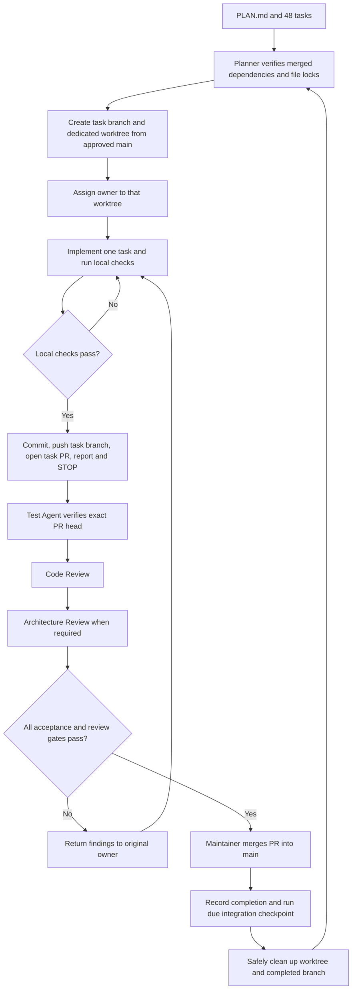
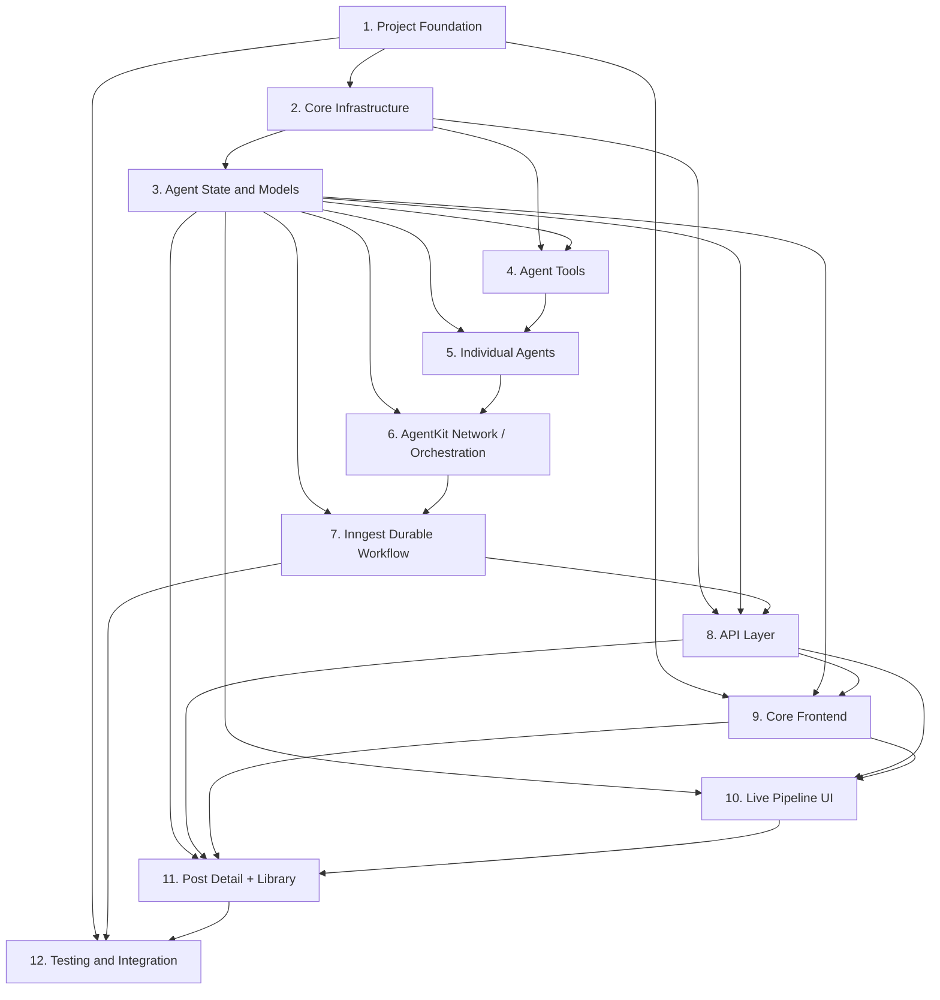

# PostForge — MVP Implementation Task Plan

Status: the 48-task decomposition and specialist roles are approved. This branch/worktree/PR execution update awaits user approval. All implementation tasks remain pending. Documentation only: no repository setup, task branches/worktrees, PRs, or implementation agents have been started by this update.

## Resolved planning decisions

### Shared model configuration

- Default development text model: **GLM-5.3-Flash through OpenRouter**.
- Use **OPENROUTER_MODEL** to select the text model and **OPENROUTER_API_KEY** for credentials. Retire the previous model variable and model-specific factory names.
- One provider-neutral shared model factory supplies every agent. Agent implementations, prompts, tools, and routing contain no hard-coded model identifiers.
- The development environment example sets OPENROUTER_MODEL to the verified OpenRouter identifier for GLM-5.3-Flash. Confirm the exact catalog identifier, availability, and required capabilities in P1-01; the previous plan's identifier is not considered verified.
- Missing or blank OPENROUTER_MODEL produces a configuration error, with no silent fallback to another model.
- Switching later to GPT-5 or another compatible OpenRouter model requires changing the environment variable and restarting/redeploying, with no agent-code changes.
- Snapshot the model and image configuration on each run. A resumed run retains its original selection.
- Compatibility means the model supports the message/tool/structured-output behavior required by the selected integration. Configurability does not imply all catalog models support those capabilities.

### Core MVP

**Topic Input → Research → Verification → Writing → Editing → Image Generation → Save/Publish to database → Final Post + Sources.**

Required UI:

- New Post/topic input.
- Live six-agent pipeline.
- Final post detail.
- Sources and verification information.
- Basic past-post library.

Publish means saving the finished post to MongoDB. The pipeline runs without a human review gate and reports failure if it cannot produce a supported result.

**Excluded from MVP:** authentication, analytics dashboard, settings UI, scheduling/cron UI and scheduled execution, social media publishing, pricing, and marketing features. These remain future design phases in DESIGN_PROMPT.md and never block MVP completion.

Also defer token streaming, advanced library filters/view toggles, per-run model controls, regenerate/delete actions, prior-post retrieval as agent memory, duplicate-topic intelligence, and additional image-provider adapters.

### Technical assumptions

- Planned stack: Next.js App Router/TypeScript, Inngest durable execution, Inngest AgentKit, OpenRouter text models, Serper search, MongoDB, and GridFS.
- Gemini/Nano Banana remains the intended initial image provider behind an interchangeable interface. Validate its model identifier in P1-01. Configure it with IMAGE_PROVIDER and IMAGE_MODEL. A future OpenAI image adapter is not an MVP dependency.
- Server configuration: OPENROUTER_API_KEY, OPENROUTER_MODEL, SERPER_API_KEY, GEMINI_API_KEY, IMAGE_PROVIDER, IMAGE_MODEL, MONGODB_URI, MONGODB_DB, and Inngest event/signing keys as required by the environment.
- Use the Node.js server runtime for database, GridFS, and workflow integrations. Secrets never enter browser bundles or public responses.
- Live progress uses polling of persisted stage state. Show actual activity and available outputs; token-by-token text/image streaming is not required.
- Validate AgentKit/Inngest integration and step boundaries. Wrapping a network call in a workflow must not be assumed to make every nested operation durable automatically.
- One submission identity maps to one post/run across dispatch retries, event redelivery, and workflow retries. A deliberate new submission may repeat the same topic.
- The six stages execute sequentially within a run. Parallel implementation eligibility does not change runtime stage ordering.
- Package/model availability and current APIs are verification tasks, not claims of already confirmed compatibility.

## Runtime flow and data contracts

1. Browser submits a bounded topic and stable submission key to POST /api/generate.
2. API saves a queued post, selected model/provider configuration, and dispatch identity, sends the Inngest event, then returns the post ID. Same-key/same-topic retries reuse the record; same-key/different-topic requests conflict.
3. Durable workflow reconstructs run state, executes the AgentKit network, and checkpoints stage activity/results.
4. Research creates source-linked findings. Verify assigns supported, unsupported, or conflicting verdicts with evidence and explanations.
5. At least one supported finding is required before Writer. Zero supported findings ends the run as insufficient evidence; there is no unbounded research loop.
6. Writer and Editor produce structured content with claim/source references. Unknown or unsupported references are rejected. Finite correction budgets prevent endless model loops.
7. Illustrator stores a completed poster. Publisher validates the deliverable and persists it before reporting done.
8. Browser polls GET /api/posts/[id], stops on terminal status, and renders the result/failure. GET /api/posts provides the library; GET /api/posters/[id] serves images.

Planned shared contracts:

| Contract | Required contents |
|---|---|
| Post/run | Post ID, submission key, topic, event/run correlation, dispatch state, model/image snapshot, schema version, stage state, outputs, poster ID, timestamps, sanitized error |
| Overall status | queued, researching, verifying, writing, editing, illustrating, publishing, done, failed |
| Stage status | queued, active, retrying, done, failed; attempts, start/end timestamps, safe activity summaries |
| Evidence | Stable finding/source IDs, claim, public source URL/title, fetched evidence, verdict, rationale, corroborating references |
| Article | Title, structured body with claim/source references, deduplicated cited sources |
| Poster | GridFS ID, post/stage association, media type, byte size, completed-upload metadata |
| Browser DTO | Serialized public fields; no secrets, connection details, raw fetched pages, or internal provider payloads |

Unstarted stages remain queued after a run fails. Empty arrays are not evidence of stage success. Verification verdicts describe evidence assessment, not guaranteed truth.

Define finite topic/content/result sizes, timeouts, stage correction attempts, provider retries, and total network iterations in shared contracts/configuration.

## Official development workflow — branches, worktrees, and pull requests

### Roles and concurrency

| Role | Scope |
|---|---|
| Planner / Orchestrator Agent (PL) | Select runnable tasks, record dependency/merge evidence, reserve files, assign worktrees, coordinate handoffs. No production code. |
| Architecture Reviewer (AR) | Protect PLAN.md; review architecture, shared state/types, orchestration, database design, and major shared files. |
| Backend / Infrastructure Agent (BE) | Foundation, server configuration, MongoDB/GridFS, image adapter, repository, Inngest, APIs. |
| Agent-System Agent (AS) | AgentKit, state/contracts, model factory, tools, six agents, routing, network checkpoints. |
| Frontend Agent (FE) | App shell, topic form, article/sources, final detail, library, shared UI styles. |
| Pipeline UI Agent (PU) | Timeline, polling, activity/retry/failure/completion states, initial live run page. |
| Test Agent (TE) | Independent unit/integration/API/browser/failure verification; owns specifically assigned test tasks. |
| Code Review Agent (CR) | Types, maintainability, duplication, security, error handling; read-only review. |
| Integration Agent (IN) | Cross-service milestone checks; designated merge/cleanup maintainer after execution authorization. |

These are reusable specialist roles, not 48 agents. At most three specialists run alongside the Planner. Each owner implements one task at a time. A specialist already implementing a task cannot independently test that same task. Test-owned tasks use IN as independent tester; integration-owned tasks use TE.

PLAN.md is the technical source of truth; DESIGN_PROMPT.md is the UI source of truth. The configurable GLM/OpenRouter default and MVP exclusions above remain binding.

### Git/GitHub baseline before TASK-001

Git/GitHub must exist before the first implementation task. Repository setup is an administrative prerequisite, not an extra application task or permission to scaffold.

After this workflow is approved for execution, the Planner and Integration maintainer must:

1. Confirm the intended GitHub owner/repository and visibility; do not guess a public destination.
2. Inspect existing repository/remote state before initializing anything. The repository root is the workspace containing PLAN.md and DESIGN_PROMPT.md; application paths remain under post-forge/.
3. Establish a reviewed documentation-only main baseline containing the approved planning documents and root ignore rules. Ignore /.worktrees/, local environment/credential files, dependencies, builds, and test artifacts before any staging. Environment examples may be tracked; real .env values may not.
4. For a new empty remote, the designated maintainer publishes this initial reviewed baseline to main. This one-time seed is not an implementation-agent bypass. For an existing repository, use its normal reviewed PR procedure.
5. Configure available GitHub protections: implementation owners cannot update main directly; merging requires a PR, current test evidence, Code Review approval, and Architecture approval where required. Verify that account/repository capabilities can enforce the intended controls; report unmet controls instead of claiming they exist.
6. Require available task checks from the start. TASK-001 uses documentation review; TASK-002 uses independently reproduced scaffold checks. TASK-003 introduces root PR CI for the established offline test scripts. Apply required automated checks as those checks become available.
7. Keep repository policies and baseline operations reviewable. This planning turn performs none of these operations.

### Identity, branch base, and worktree layout

- Preserve existing IDs P1-01 through P12-05. TASK-001 through TASK-048 are their stable Git numbering aliases, assigned in the existing plan order. Example branch numbers in earlier conversation were illustrative; the exact mapping in each task below is authoritative.
- Every task, including documentation/test tasks, gets one dedicated task branch, one dedicated writable worktree, its own commits, and one GitHub PR into main.
- Branches belong to tasks, never permanently to agents.
- Branch format: task/NNN-short-name.
- Worktree format: .worktrees/task-NNN-short-name, relative to the primary repository checkout.
- Each worktree contains a complete checkout, including its own post-forge/ application directory once scaffold is merged.
- Base every new task on the latest fetched, approved origin/main. Record the actual base SHA; never use stale local main, another agent's worktree, or unmerged predecessor code.
- No stacked task branches, cherry-picking unmerged dependencies, or task-to-task integration branches. The integration base is main.
- The primary checkout stays on main for maintainer coordination. Owners never switch the primary checkout or work in another task's worktree.
- Worktrees isolate working directories and indexes but share Git repository metadata. Creation/removal, branch deletion, and primary-checkout operations are maintainer-only. An owner's working-directory boundary does not authorize shared Git administration.

### Task lifecycle

1. **Planner readiness check:** every listed predecessor PR is merged into approved main, applicable integration gates pass, the owner is available, and the exact file allowlist has no active conflicts.
2. **Reserve scope:** record task ID, owner, branch, worktree, base SHA, allowed paths, high-conflict locks, checks, reviewers, and acceptance criteria.
3. **Create isolation:** from the clean primary checkout, fetch origin and fast-forward main only. Create the task branch/worktree from the recorded origin/main SHA. If a task branch already exists, verify it belongs to this task and resume its existing worktree; never reset unrelated work.
4. **Assign owner:** supply the absolute worktree path. The owner checks its cwd, branch, HEAD/base, and clean starting status before editing.
5. **Implement one task:** modify only its allowed paths inside its worktree; run scoped tests and available type/lint checks. Do not alter shared files opportunistically.
6. **Local failure:** remain in the same branch/worktree; fix only task-related problems and rerun affected checks. Missing predecessor behavior is escalated to the Planner, not copied from another unmerged branch.
7. **Commit and push:** review the diff and stage explicit allowed paths rather than blanket git add .; exclude credentials and generated artifacts. Use the task's conventional commit, then push only its task branch.
8. **Open PR:** create the single task PR into main with task/dependency links, original base/current head SHAs, changes, acceptance checklist, exact test results, and risks/limits.
9. **Report and STOP:** the owner produces the required report below and becomes idle. Pushing/opening a PR is not task completion and does not authorize another task.
10. **Independent Test review:** verify the PR's exact pushed head in its assigned task worktree while the owner is paused, or in an isolated CI checkout of that head. Test execution may write ignored artifacts but must not alter tracked implementation/tests.
11. **Code Review:** inspect the same PR diff and SHA. **Architecture Review follows** when the task or actual diff affects architecture, shared state/types, orchestration, database design, or major shared files.
12. **Failed review/test:** send specific findings to the original owner. The owner resumes the SAME branch and SAME worktree, commits a fix, pushes, updates the SAME PR, reports, and stops again.
13. **Changed head or base:** invalidate prior review/test evidence for changed code. If main advanced with relevant changes, the owner merges approved origin/main into its task branch, resolves only task-related conflicts, reruns checks, pushes, and gets renewed review. No rebase/force-push workflow is required.
14. **Merge:** only the designated Integration maintainer merges through GitHub after all gates pass for the current head and its combination with approved main. Serialize merges. Use a merge commit to preserve task commits; do not directly push or locally fast-forward implementation into main.
15. **Record and integrate:** record PR URL, reviewed head SHA, merge SHA, and checks. Perform the due integration checkpoint; hold dependent work if it fails.
16. **Cleanup:** after confirmed merge and no active users of the worktree, the maintainer fast-forwards primary main, checks that the task worktree has no tracked/untracked work to preserve, verifies its resolved path is inside the intended .worktrees directory, and removes it using git worktree remove without force. Delete the merged local branch with the safe merged-branch check; never force-delete uncertain work. Remote branch deletion is optional after merge.
17. **Next assignment:** only the Planner chooses and explicitly assigns the next ready task. Owners never self-start another task.

Unmerged review fixes stay on the original branch/worktree/PR. If a defect is discovered after that PR has merged, stop affected dependents and create an explicitly scoped corrective task with its own branch/worktree/PR linked to the original task. Do not reuse a merged PR, rewrite main, or hide the fix in an unrelated task. No extra corrective tasks are created by this plan update.



The diagram abbreviates failed test/review routing: any failed gate returns immediately to the original owner. The full sequence above controls execution.

### Strict file ownership and reviewer behavior

- Separate branches/worktrees do not remove file-conflict risk. Two active tasks may not modify the same file.
- Locks are repo-relative path locks across all worktrees, held through implementation and PR resolution until merge. A later writer starts from main after the earlier writer's PR merges.
- package.json and its lockfile form one atomic lock group. tsconfig/Next/lint/test/CI configuration, environment examples, shared types/state/model/network infrastructure, and global styles are high-conflict files.
- Shared reports and README files also require locks. Phase 12 tasks are deliberately scheduled sequentially because they share docs/verification.md and specialist roles.
- A task's listed files are an allowlist. Where scaffold filenames depend on P1-01's selected tooling, the Planner resolves those names explicitly before assignment; generic labels are not permission to edit arbitrary configuration.
- Dependency changes needed by another task must be explicitly scoped and serialized under the manifest/lockfile lock; no background package installs by other owners.
- Reviewers/testers are read-only with respect to tracked branch files unless explicitly reassigned as a fix owner by the Planner. Failures return to the original owner by default. Reviewers do not weaken tests or rewrite large implementation sections.
- Architecture Reviewer owns TASK-001's compatibility documentation and therefore does not approve their own work; Code Review supplies independent review for that task.
- PLAN.md is not edited by every owner to mark progress. PR/task reports track active status. Amendments to PLAN.md or DESIGN_PROMPT.md use an explicitly scoped, reviewed documentation change and an exclusive lock; no direct main edits. P1-01/P12-05 include limited PLAN.md scope coordinated by the Planner.
- P10-03 owns run-view.tsx initially. FE may modify it in P11-02 only after P10-03 merges and its lock is released.
- Each active worktree uses its own ignored dependencies/build outputs and test artifacts. Concurrent servers need separate ports and isolated test database names; never share mutable build output or test data.

### PR and merge gates

Every task PR must identify its task number/name, owner, predecessor PRs and merge SHAs, allowed/changed files, base/head SHA, commands and results, acceptance checklist, and any remaining limitation.

A merge requires:

- Scoped implementation complete and acceptance criteria met.
- Owner's local checks and independent tester verification pass.
- Available required CI checks pass on the current PR head.
- Code Review approval matches the current head.
- Architecture approval matches the current head when required.
- No unresolved review findings, file ownership violations, unmerged dependencies, or merge conflicts.
- Compatibility with the current approved main is verified before merge.
- Integration maintainer is the merger; implementation owners never push main.

New commits invalidate stale approvals as appropriate. Repository protections/checks must reflect these rules; a role name in this document is not itself a GitHub approval. When GitHub identities cannot provide independent formal approval, obtain the required independent maintainer review rather than self-approving or bypassing protections.

### Required implementation-agent report

```text
TASK: Pn-nn / TASK-NNN — task name
OWNER: assigned specialist
BRANCH: task/NNN-short-name
WORKTREE: absolute path to the assigned worktree
FILES CHANGED: explicit repo-relative list
TESTS RUN: exact commands/checks
TEST RESULT: PASS / FAIL / BLOCKED, with evidence
COMMIT HASH: full pushed head SHA
PUSH STATUS: pushed / failed / not attempted
PR STATUS: URL and draft/open/review status
READY FOR REVIEW: YES / NO
```

If push or PR creation fails, report it truthfully and remain on the same task. READY FOR REVIEW is YES only when required local checks pass, the exact commit is pushed, and the PR is available for review. Then stop.

### Task conventions and test commands

All application paths in task file lists are relative to post-forge/ inside that task's worktree. Explicitly marked root files (PLAN.md and .github/workflows/task-checks.yml) are relative to the worktree root. Worktree paths below are relative to the primary checkout, not nested inside each worktree.

Task metadata repeats branch, worktree, base, owner/review/test responsibilities, allowlist, conflict scope, acceptance, checks, commit, PR/merge requirements, parallel eligibility, and handoff for all 48 tasks. Dependencies in the task graph remain unchanged; file locks and owner availability impose additional scheduling constraints.

Planned npm scripts are defined during P1-02/P1-03 and extended only within scoped later tasks: typecheck, lint, build, test:unit, test:integration, test:browser, test:e2e. P7-04 documents dev:inngest. Focused test scripts accept the listed test path as an argument. Commands run from the task worktree's post-forge/ directory using isolated test configuration. These are planned commands, not claims that scripts or tests already exist.

No unrelated test suite is required merely because it exists; run task checks, affected regressions, and the milestone checks appropriate to the change. Real-provider verification is explicitly separate from fixture-based checks.


## Phase 1 — Project Foundation

### P1-01 — Validate integration assumptions

- **Task ID:** P1-01 (TASK-001).
- **Task Name:** Validate integration assumptions.
- **Goal:** Establish a usable compatibility baseline.
- **Owner Agent:** Architecture Reviewer.
- **Reviewer:** Code Review Agent; Architecture Reviewer is the task owner and does not self-review.
- **Tester:** Test Agent (independent of this task's owner).
- **Branch:** `task/001-validate-integrations`.
- **Worktree:** `.worktrees/task-001-validate-integrations` relative to the primary repository checkout.
- **Base Branch:** Latest approved `origin/main`; record its fetched commit SHA when creating this task branch. PR target: `main`.
- **Dependencies:** None; user approval gates execution.
- **Files Owned:** docs/compatibility.md; root PLAN.md only for a reviewed architecture amendment coordinated by the Planner. Exact allowlist; no edits outside it without a reviewed scope amendment.
- **High-conflict files:** Root PLAN.md, if an architecture amendment is necessary; exclusive documentation lock.
- **Acceptance Criteria:** Record official documentation and selected runtime/package versions; verify GLM-5.3-Flash's OpenRouter identifier, availability, tool/structured-output support, AgentKit custom endpoint support, AgentKit/Inngest durable integration, and initial image model. Do not substitute another default if the requested model is unavailable.
- **Test Command:** Read-only check; no application test command. Read-only documentation/catalog checks; distinguish documented support from live checks needing credentials.
- **Commit Convention:** `docs(architecture): validate integration compatibility`; scoped follow-up corrections use `fix:`, `test:`, or `docs:` as appropriate.
- **PR Requirement:** Exactly one GitHub PR for this task: `task/001-validate-integrations` → `main`; title includes P1-01/TASK-001; link dependencies, base/head SHAs, scope, acceptance checklist, and test evidence. Reviews assess the exact current pushed head.
- **Merge Requirement:** Owner implementation/local checks, independent tester verification, Code Review approval, Architecture approval when required, and all acceptance criteria pass on the latest reviewed head integrated with approved main. Only the designated Integration maintainer merges through GitHub. No owner direct push to main.
- **Can Run In Parallel:** No — sequential baseline/finalization task.
- **Handoff Condition:** Before review: satisfy this task's acceptance criteria, commit and push only its scoped changes, open/update its single PR, report the exact head SHA and required status fields, then STOP. On failure, the original owner fixes this same branch/worktree. After merge: Integration maintainer records the merge SHA and cleans up safely; only then may the Planner release dependent tasks.

### P1-02 — Scaffold the approved application

- **Task ID:** P1-02 (TASK-002).
- **Task Name:** Scaffold the approved application.
- **Goal:** Create a minimal TypeScript App Router application.
- **Owner Agent:** Backend / Infrastructure Agent.
- **Reviewer:** Code Review Agent, then Architecture Reviewer (required).
- **Tester:** Test Agent (independent of this task's owner).
- **Branch:** `task/002-project-scaffold`.
- **Worktree:** `.worktrees/task-002-project-scaffold` relative to the primary repository checkout.
- **Base Branch:** Latest approved `origin/main`; record its fetched commit SHA when creating this task branch. PR target: `main`.
- **Dependencies:** P1-01.
- **Files Owned:** package.json, lockfile, tsconfig.json, next.config.ts, lint configuration, .gitignore, src/app/layout.tsx, src/app/page.tsx, src/app/globals.css, README.md. Exact allowlist; no edits outside it without a reviewed scope amendment.
- **High-conflict files:** package.json, lockfile, tsconfig.json, next.config.ts, lint configuration, .gitignore, src/app/layout.tsx, src/app/page.tsx, src/app/globals.css, README.md.
- **Acceptance Criteria:** Agreed runtime and dependency versions; strict TypeScript; application starts/builds; secrets and build artifacts ignored; no excluded-feature scaffolding.
- **Test Command:** `npm run typecheck`; `npm run lint`; `npm run build`. Lockfile install, typecheck, lint, build, and starter-page browser inspection using scaffold tooling.
- **Commit Convention:** `chore(app): scaffold the MVP application`; scoped follow-up corrections use `fix:`, `test:`, or `docs:` as appropriate.
- **PR Requirement:** Exactly one GitHub PR for this task: `task/002-project-scaffold` → `main`; title includes P1-02/TASK-002; link dependencies, base/head SHAs, scope, acceptance checklist, and test evidence. Reviews assess the exact current pushed head.
- **Merge Requirement:** Owner implementation/local checks, independent tester verification, Code Review approval, Architecture approval when required, and all acceptance criteria pass on the latest reviewed head integrated with approved main. Only the designated Integration maintainer merges through GitHub. No owner direct push to main.
- **Can Run In Parallel:** No — sequential baseline/finalization task.
- **Handoff Condition:** Before review: satisfy this task's acceptance criteria, commit and push only its scoped changes, open/update its single PR, report the exact head SHA and required status fields, then STOP. On failure, the original owner fixes this same branch/worktree. After merge: Integration maintainer records the merge SHA and cleans up safely; only then may the Planner release dependent tasks.

### P1-03 — Establish verification tooling

- **Task ID:** P1-03 (TASK-003).
- **Task Name:** Establish verification tooling.
- **Goal:** Provide repeatable unit, integration, and browser checks.
- **Owner Agent:** Test Agent.
- **Reviewer:** Code Review Agent, then Architecture Reviewer (required for shared configuration/state or major shared UI files).
- **Tester:** Integration Agent (independent of this task's owner).
- **Branch:** `task/003-test-tooling`.
- **Worktree:** `.worktrees/task-003-test-tooling` relative to the primary repository checkout.
- **Base Branch:** Latest approved `origin/main`; record its fetched commit SHA when creating this task branch. PR target: `main`.
- **Dependencies:** P1-02.
- **Files Owned:** package.json, lockfile, unit/integration test configuration, playwright.config.ts, tests/helpers/setup.ts. Root .github/workflows/task-checks.yml. Exact allowlist; no edits outside it without a reviewed scope amendment.
- **High-conflict files:** package.json, lockfile, test configuration, playwright.config.ts, tests/helpers/setup.ts; root .github/workflows/task-checks.yml.
- **Acceptance Criteria:** Separate runnable test commands; fixture provider substitution; isolated integration database configuration with no production defaults. Establish the planned npm check scripts and PR CI for available offline checks; CI must not require production secrets.
- **Test Command:** `npm run typecheck`; `npm run lint`; `npm run test:unit`; `npm run test:integration`; `npm run test:browser`. Harness smoke check and browser launch against starter page.
- **Commit Convention:** `test(tooling): configure automated verification`; scoped follow-up corrections use `fix:`, `test:`, or `docs:` as appropriate.
- **PR Requirement:** Exactly one GitHub PR for this task: `task/003-test-tooling` → `main`; title includes P1-03/TASK-003; link dependencies, base/head SHAs, scope, acceptance checklist, and test evidence. Reviews assess the exact current pushed head.
- **Merge Requirement:** Owner implementation/local checks, independent tester verification, Code Review approval, Architecture approval when required, and all acceptance criteria pass on the latest reviewed head integrated with approved main. Only the designated Integration maintainer merges through GitHub. No owner direct push to main.
- **Can Run In Parallel:** Yes — with P9-01 after P1-02 merges; P9-01 must not modify package/lock/test configuration files.
- **Handoff Condition:** Before review: satisfy this task's acceptance criteria, commit and push only its scoped changes, open/update its single PR, report the exact head SHA and required status fields, then STOP. On failure, the original owner fixes this same branch/worktree. After merge: Integration maintainer records the merge SHA and cleans up safely; only then may the Planner release dependent tasks.

## Phase 2 — Core Infrastructure

### P2-01 — Validate server configuration

- **Task ID:** P2-01 (TASK-004).
- **Task Name:** Validate server configuration.
- **Goal:** Centralize environment variables and finite operational limits.
- **Owner Agent:** Backend / Infrastructure Agent.
- **Reviewer:** Code Review Agent, then Architecture Reviewer (required).
- **Tester:** Test Agent (independent of this task's owner).
- **Branch:** `task/004-environment-config`.
- **Worktree:** `.worktrees/task-004-environment-config` relative to the primary repository checkout.
- **Base Branch:** Latest approved `origin/main`; record its fetched commit SHA when creating this task branch. PR target: `main`.
- **Dependencies:** P1-02, P1-03.
- **Files Owned:** .env.example, src/lib/config.ts, tests/unit/config.test.ts, README.md. Exact allowlist; no edits outside it without a reviewed scope amendment.
- **High-conflict files:** .env.example, src/lib/config.ts, README.md.
- **Acceptance Criteria:** Development example sets verified GLM identifier via OPENROUTER_MODEL; blank required values fail clearly at server entry points; unsupported image providers rejected; limits/timeouts defined once; secrets stay server-only.
- **Test Command:** `npm run typecheck`; `npm run lint`; `npm run test:unit -- tests/unit/config.test.ts`. Missing/blank/valid variables, unsupported provider, boundary limits, and redacted errors with fake credentials.
- **Commit Convention:** `feat(config): validate server environment`; scoped follow-up corrections use `fix:`, `test:`, or `docs:` as appropriate.
- **PR Requirement:** Exactly one GitHub PR for this task: `task/004-environment-config` → `main`; title includes P2-01/TASK-004; link dependencies, base/head SHAs, scope, acceptance checklist, and test evidence. Reviews assess the exact current pushed head.
- **Merge Requirement:** Owner implementation/local checks, independent tester verification, Code Review approval, Architecture approval when required, and all acceptance criteria pass on the latest reviewed head integrated with approved main. Only the designated Integration maintainer merges through GitHub. No owner direct push to main.
- **Can Run In Parallel:** Yes — only with a different available owner, merged predecessors, separate worktree/branch, and no overlapping file locks.
- **Handoff Condition:** Before review: satisfy this task's acceptance criteria, commit and push only its scoped changes, open/update its single PR, report the exact head SHA and required status fields, then STOP. On failure, the original owner fixes this same branch/worktree. After merge: Integration maintainer records the merge SHA and cleans up safely; only then may the Planner release dependent tasks.

### P2-02 — Define safe error handling

- **Task ID:** P2-02 (TASK-005).
- **Task Name:** Define safe error handling.
- **Goal:** Classify errors consistently across tools, workflows, and APIs.
- **Owner Agent:** Backend / Infrastructure Agent.
- **Reviewer:** Code Review Agent, then Architecture Reviewer (required).
- **Tester:** Test Agent (independent of this task's owner).
- **Branch:** `task/005-error-handling`.
- **Worktree:** `.worktrees/task-005-error-handling` relative to the primary repository checkout.
- **Base Branch:** Latest approved `origin/main`; record its fetched commit SHA when creating this task branch. PR target: `main`.
- **Dependencies:** P1-02, P1-03.
- **Files Owned:** src/lib/errors.ts, src/lib/logging.ts, tests/unit/errors.test.ts. Exact allowlist; no edits outside it without a reviewed scope amendment.
- **High-conflict files:** src/lib/errors.ts, src/lib/logging.ts (shared server contracts).
- **Acceptance Criteria:** Distinct input/configuration/evidence/transient/terminal codes; retry classification; sanitized public errors; logs correlate post/stage IDs without credentials or raw provider payloads.
- **Test Command:** `npm run typecheck`; `npm run lint`; `npm run test:unit -- tests/unit/errors.test.ts`. Representative failure mapping, redaction, and retry decisions.
- **Commit Convention:** `feat(errors): add safe error classification`; scoped follow-up corrections use `fix:`, `test:`, or `docs:` as appropriate.
- **PR Requirement:** Exactly one GitHub PR for this task: `task/005-error-handling` → `main`; title includes P2-02/TASK-005; link dependencies, base/head SHAs, scope, acceptance checklist, and test evidence. Reviews assess the exact current pushed head.
- **Merge Requirement:** Owner implementation/local checks, independent tester verification, Code Review approval, Architecture approval when required, and all acceptance criteria pass on the latest reviewed head integrated with approved main. Only the designated Integration maintainer merges through GitHub. No owner direct push to main.
- **Can Run In Parallel:** Yes — only with a different available owner, merged predecessors, separate worktree/branch, and no overlapping file locks.
- **Handoff Condition:** Before review: satisfy this task's acceptance criteria, commit and push only its scoped changes, open/update its single PR, report the exact head SHA and required status fields, then STOP. On failure, the original owner fixes this same branch/worktree. After merge: Integration maintainer records the merge SHA and cleans up safely; only then may the Planner release dependent tasks.

### P2-03 — Connect to MongoDB

- **Task ID:** P2-03 (TASK-006).
- **Task Name:** Connect to MongoDB.
- **Goal:** Supply a reusable server-only database connection.
- **Owner Agent:** Backend / Infrastructure Agent.
- **Reviewer:** Code Review Agent, then Architecture Reviewer (required).
- **Tester:** Test Agent (independent of this task's owner).
- **Branch:** `task/006-mongodb-connection`.
- **Worktree:** `.worktrees/task-006-mongodb-connection` relative to the primary repository checkout.
- **Base Branch:** Latest approved `origin/main`; record its fetched commit SHA when creating this task branch. PR target: `main`.
- **Dependencies:** P2-01, P2-02.
- **Files Owned:** src/lib/mongo.ts, tests/integration/mongo.test.ts. Exact allowlist; no edits outside it without a reviewed scope amendment.
- **High-conflict files:** src/lib/mongo.ts (shared database infrastructure).
- **Acceptance Criteria:** Connection reuse across development reloads; explicit database name; sanitized failures; integration tests cannot silently use the application database.
- **Test Command:** `npm run typecheck`; `npm run lint`; `npm run test:integration -- tests/integration/mongo.test.ts`. Isolated connect/read/write and invalid-connection handling.
- **Commit Convention:** `feat(database): add MongoDB connection`; scoped follow-up corrections use `fix:`, `test:`, or `docs:` as appropriate.
- **PR Requirement:** Exactly one GitHub PR for this task: `task/006-mongodb-connection` → `main`; title includes P2-03/TASK-006; link dependencies, base/head SHAs, scope, acceptance checklist, and test evidence. Reviews assess the exact current pushed head.
- **Merge Requirement:** Owner implementation/local checks, independent tester verification, Code Review approval, Architecture approval when required, and all acceptance criteria pass on the latest reviewed head integrated with approved main. Only the designated Integration maintainer merges through GitHub. No owner direct push to main.
- **Can Run In Parallel:** Yes — only with a different available owner, merged predecessors, separate worktree/branch, and no overlapping file locks.
- **Handoff Condition:** Before review: satisfy this task's acceptance criteria, commit and push only its scoped changes, open/update its single PR, report the exact head SHA and required status fields, then STOP. On failure, the original owner fixes this same branch/worktree. After merge: Integration maintainer records the merge SHA and cleans up safely; only then may the Planner release dependent tasks.

### P2-04 — Implement poster storage

- **Task ID:** P2-04 (TASK-007).
- **Task Name:** Implement poster storage.
- **Goal:** Store and retrieve completed image bytes through GridFS.
- **Owner Agent:** Backend / Infrastructure Agent.
- **Reviewer:** Code Review Agent, then Architecture Reviewer (required).
- **Tester:** Test Agent (independent of this task's owner).
- **Branch:** `task/007-poster-storage`.
- **Worktree:** `.worktrees/task-007-poster-storage` relative to the primary repository checkout.
- **Base Branch:** Latest approved `origin/main`; record its fetched commit SHA when creating this task branch. PR target: `main`.
- **Dependencies:** P2-03.
- **Files Owned:** src/lib/poster-storage.ts, tests/integration/poster-storage.test.ts. Exact allowlist; no edits outside it without a reviewed scope amendment.
- **High-conflict files:** src/lib/poster-storage.ts (shared storage interface).
- **Acceptance Criteria:** Validate media type/size; associate uploads with post/stage; expose completed uploads only; reuse completed results on retries; handle interrupted/concurrent uploads without broken references.
- **Test Command:** `npm run typecheck`; `npm run lint`; `npm run test:integration -- tests/integration/poster-storage.test.ts`. Byte round trip, unsupported/oversized images, interrupted upload, duplicate/concurrent attempts.
- **Commit Convention:** `feat(storage): add GridFS poster storage`; scoped follow-up corrections use `fix:`, `test:`, or `docs:` as appropriate.
- **PR Requirement:** Exactly one GitHub PR for this task: `task/007-poster-storage` → `main`; title includes P2-04/TASK-007; link dependencies, base/head SHAs, scope, acceptance checklist, and test evidence. Reviews assess the exact current pushed head.
- **Merge Requirement:** Owner implementation/local checks, independent tester verification, Code Review approval, Architecture approval when required, and all acceptance criteria pass on the latest reviewed head integrated with approved main. Only the designated Integration maintainer merges through GitHub. No owner direct push to main.
- **Can Run In Parallel:** Yes — only with a different available owner, merged predecessors, separate worktree/branch, and no overlapping file locks.
- **Handoff Condition:** Before review: satisfy this task's acceptance criteria, commit and push only its scoped changes, open/update its single PR, report the exact head SHA and required status fields, then STOP. On failure, the original owner fixes this same branch/worktree. After merge: Integration maintainer records the merge SHA and cleans up safely; only then may the Planner release dependent tasks.

### P2-05 — Implement image provider abstraction

- **Task ID:** P2-05 (TASK-008).
- **Task Name:** Implement image provider abstraction.
- **Goal:** Isolate generation behind one interface and initial Gemini adapter.
- **Owner Agent:** Backend / Infrastructure Agent.
- **Reviewer:** Code Review Agent, then Architecture Reviewer (required).
- **Tester:** Test Agent (independent of this task's owner).
- **Branch:** `task/008-image-provider`.
- **Worktree:** `.worktrees/task-008-image-provider` relative to the primary repository checkout.
- **Base Branch:** Latest approved `origin/main`; record its fetched commit SHA when creating this task branch. PR target: `main`.
- **Dependencies:** P2-01, P2-02.
- **Files Owned:** src/lib/image.ts, src/lib/image-providers/gemini.ts, tests/unit/image-provider.test.ts. Exact allowlist; no edits outside it without a reviewed scope amendment.
- **High-conflict files:** src/lib/image.ts (shared provider interface).
- **Acceptance Criteria:** Accept prompt, return validated bytes/type; use saved provider/model configuration; classify timeout/empty/malformed responses; permit future adapters without agent changes. No second adapter required.
- **Test Command:** `npm run typecheck`; `npm run lint`; `npm run test:unit -- tests/unit/image-provider.test.ts`. Stub success, timeout, malformed/empty result, unsupported provider; live check in P12-04.
- **Commit Convention:** `feat(images): add configurable image provider`; scoped follow-up corrections use `fix:`, `test:`, or `docs:` as appropriate.
- **PR Requirement:** Exactly one GitHub PR for this task: `task/008-image-provider` → `main`; title includes P2-05/TASK-008; link dependencies, base/head SHAs, scope, acceptance checklist, and test evidence. Reviews assess the exact current pushed head.
- **Merge Requirement:** Owner implementation/local checks, independent tester verification, Code Review approval, Architecture approval when required, and all acceptance criteria pass on the latest reviewed head integrated with approved main. Only the designated Integration maintainer merges through GitHub. No owner direct push to main.
- **Can Run In Parallel:** Yes — only with a different available owner, merged predecessors, separate worktree/branch, and no overlapping file locks.
- **Handoff Condition:** Before review: satisfy this task's acceptance criteria, commit and push only its scoped changes, open/update its single PR, report the exact head SHA and required status fields, then STOP. On failure, the original owner fixes this same branch/worktree. After merge: Integration maintainer records the merge SHA and cleans up safely; only then may the Planner release dependent tasks.

## Phase 3 — Agent State and Models

### P3-01 — Define post and evidence contracts

- **Task ID:** P3-01 (TASK-009).
- **Task Name:** Define post and evidence contracts.
- **Goal:** Share validated shapes across persistence, agents, and APIs.
- **Owner Agent:** Agent-System Agent.
- **Reviewer:** Code Review Agent, then Architecture Reviewer (required).
- **Tester:** Test Agent (independent of this task's owner).
- **Branch:** `task/009-shared-contracts`.
- **Worktree:** `.worktrees/task-009-shared-contracts` relative to the primary repository checkout.
- **Base Branch:** Latest approved `origin/main`; record its fetched commit SHA when creating this task branch. PR target: `main`.
- **Dependencies:** P2-01, P2-02.
- **Files Owned:** src/lib/contracts/post.ts, src/lib/contracts/evidence.ts, src/lib/contracts/api.ts, tests/unit/contracts.test.ts. Exact allowlist; no edits outside it without a reviewed scope amendment.
- **High-conflict files:** src/lib/contracts/post.ts, src/lib/contracts/evidence.ts, src/lib/contracts/api.ts.
- **Acceptance Criteria:** Define runtime contracts above, finite input/output bounds, submission identity, article references, and browser DTOs; reject invalid IDs/URLs/verdicts; preserve unsupported/conflicting evidence separately.
- **Test Command:** `npm run typecheck`; `npm run lint`; `npm run test:unit -- tests/unit/contracts.test.ts`. Valid fixtures, malformed IDs, oversized fields, missing references, unsafe URLs, public serialization.
- **Commit Convention:** `feat(contracts): define post and evidence schemas`; scoped follow-up corrections use `fix:`, `test:`, or `docs:` as appropriate.
- **PR Requirement:** Exactly one GitHub PR for this task: `task/009-shared-contracts` → `main`; title includes P3-01/TASK-009; link dependencies, base/head SHAs, scope, acceptance checklist, and test evidence. Reviews assess the exact current pushed head.
- **Merge Requirement:** Owner implementation/local checks, independent tester verification, Code Review approval, Architecture approval when required, and all acceptance criteria pass on the latest reviewed head integrated with approved main. Only the designated Integration maintainer merges through GitHub. No owner direct push to main.
- **Can Run In Parallel:** Yes — only with a different available owner, merged predecessors, separate worktree/branch, and no overlapping file locks.
- **Handoff Condition:** Before review: satisfy this task's acceptance criteria, commit and push only its scoped changes, open/update its single PR, report the exact head SHA and required status fields, then STOP. On failure, the original owner fixes this same branch/worktree. After merge: Integration maintainer records the merge SHA and cleans up safely; only then may the Planner release dependent tasks.

### P3-02 — Define shared network state

- **Task ID:** P3-02 (TASK-010).
- **Task Name:** Define shared network state.
- **Goal:** Model explicit lifecycle, validated outputs, and execution budgets.
- **Owner Agent:** Agent-System Agent.
- **Reviewer:** Code Review Agent, then Architecture Reviewer (required).
- **Tester:** Test Agent (independent of this task's owner).
- **Branch:** `task/010-network-state`.
- **Worktree:** `.worktrees/task-010-network-state` relative to the primary repository checkout.
- **Base Branch:** Latest approved `origin/main`; record its fetched commit SHA when creating this task branch. PR target: `main`.
- **Dependencies:** P3-01.
- **Files Owned:** src/lib/state.ts, src/lib/stages.ts, tests/unit/state.test.ts. Exact allowlist; no edits outside it without a reviewed scope amendment.
- **High-conflict files:** src/lib/state.ts, src/lib/stages.ts.
- **Acceptance Criteria:** State holds identities, configuration snapshot, stage status, evidence, article, image reference, finite budgets, and failure; legal transitions explicit; empty outputs do not imply success; state supports durable serialization/reconstruction.
- **Test Command:** `npm run typecheck`; `npm run lint`; `npm run test:unit -- tests/unit/state.test.ts`. Valid/illegal transitions, empty findings, budget exhaustion, serialization round trip.
- **Commit Convention:** `feat(agents): define shared network state`; scoped follow-up corrections use `fix:`, `test:`, or `docs:` as appropriate.
- **PR Requirement:** Exactly one GitHub PR for this task: `task/010-network-state` → `main`; title includes P3-02/TASK-010; link dependencies, base/head SHAs, scope, acceptance checklist, and test evidence. Reviews assess the exact current pushed head.
- **Merge Requirement:** Owner implementation/local checks, independent tester verification, Code Review approval, Architecture approval when required, and all acceptance criteria pass on the latest reviewed head integrated with approved main. Only the designated Integration maintainer merges through GitHub. No owner direct push to main.
- **Can Run In Parallel:** Yes — only with a different available owner, merged predecessors, separate worktree/branch, and no overlapping file locks.
- **Handoff Condition:** Before review: satisfy this task's acceptance criteria, commit and push only its scoped changes, open/update its single PR, report the exact head SHA and required status fields, then STOP. On failure, the original owner fixes this same branch/worktree. After merge: Integration maintainer records the merge SHA and cleans up safely; only then may the Planner release dependent tasks.

### P3-03 — Configure the shared OpenRouter model factory

- **Task ID:** P3-03 (TASK-011).
- **Task Name:** Configure the shared OpenRouter model factory.
- **Goal:** Make the text model interchangeable without agent-code changes.
- **Owner Agent:** Agent-System Agent.
- **Reviewer:** Code Review Agent, then Architecture Reviewer (required).
- **Tester:** Test Agent (independent of this task's owner).
- **Branch:** `task/011-openrouter-model-factory`.
- **Worktree:** `.worktrees/task-011-openrouter-model-factory` relative to the primary repository checkout.
- **Base Branch:** Latest approved `origin/main`; record its fetched commit SHA when creating this task branch. PR target: `main`.
- **Dependencies:** P1-01, P2-01, P2-02.
- **Files Owned:** src/lib/models.ts, tests/unit/models.test.ts. Exact allowlist; no edits outside it without a reviewed scope amendment.
- **High-conflict files:** src/lib/models.ts (shared model factory).
- **Acceptance Criteria:** Provider-neutral factory uses validated OPENROUTER_MODEL and credentials for new runs and saved selection for resumed runs; no model identifiers in agents; required integration capabilities documented.
- **Test Command:** `npm run typecheck`; `npm run lint`; `npm run test:unit -- tests/unit/models.test.ts`. Construct requests using two fixture model identifiers; verify configuration switching and missing-value errors. Actual GLM compatibility checked in P12-04.
- **Commit Convention:** `feat(models): configure shared OpenRouter factory`; scoped follow-up corrections use `fix:`, `test:`, or `docs:` as appropriate.
- **PR Requirement:** Exactly one GitHub PR for this task: `task/011-openrouter-model-factory` → `main`; title includes P3-03/TASK-011; link dependencies, base/head SHAs, scope, acceptance checklist, and test evidence. Reviews assess the exact current pushed head.
- **Merge Requirement:** Owner implementation/local checks, independent tester verification, Code Review approval, Architecture approval when required, and all acceptance criteria pass on the latest reviewed head integrated with approved main. Only the designated Integration maintainer merges through GitHub. No owner direct push to main.
- **Can Run In Parallel:** Yes — only with a different available owner, merged predecessors, separate worktree/branch, and no overlapping file locks.
- **Handoff Condition:** Before review: satisfy this task's acceptance criteria, commit and push only its scoped changes, open/update its single PR, report the exact head SHA and required status fields, then STOP. On failure, the original owner fixes this same branch/worktree. After merge: Integration maintainer records the merge SHA and cleans up safely; only then may the Planner release dependent tasks.

### P3-04 — Implement the post repository

- **Task ID:** P3-04 (TASK-012).
- **Task Name:** Implement the post repository.
- **Goal:** Persist queued runs, checkpoints, final posts, and library pages.
- **Owner Agent:** Backend / Infrastructure Agent.
- **Reviewer:** Code Review Agent, then Architecture Reviewer (required).
- **Tester:** Test Agent (independent of this task's owner).
- **Branch:** `task/012-post-repository`.
- **Worktree:** `.worktrees/task-012-post-repository` relative to the primary repository checkout.
- **Base Branch:** Latest approved `origin/main`; record its fetched commit SHA when creating this task branch. PR target: `main`.
- **Dependencies:** P2-03, P3-01.
- **Files Owned:** src/lib/posts.ts, src/lib/post-indexes.ts, tests/integration/posts.test.ts. Exact allowlist; no edits outside it without a reviewed scope amendment.
- **High-conflict files:** src/lib/posts.ts, src/lib/post-indexes.ts (shared persistence).
- **Acceptance Criteria:** Unique submission identity; atomic create/reuse and guarded updates; saved dispatch/event state; completed stages cannot regress; finalization requires article/evidence/poster; bounded latest-first pagination with stable tie-breaker; safe DTO conversion.
- **Test Command:** `npm run typecheck`; `npm run lint`; `npm run test:integration -- tests/integration/posts.test.ts`. Create/read/checkpoint/finalize, duplicate keys, concurrent/stale updates, incomplete finalization, equal-timestamp pagination.
- **Commit Convention:** `feat(posts): add persistent post repository`; scoped follow-up corrections use `fix:`, `test:`, or `docs:` as appropriate.
- **PR Requirement:** Exactly one GitHub PR for this task: `task/012-post-repository` → `main`; title includes P3-04/TASK-012; link dependencies, base/head SHAs, scope, acceptance checklist, and test evidence. Reviews assess the exact current pushed head.
- **Merge Requirement:** Owner implementation/local checks, independent tester verification, Code Review approval, Architecture approval when required, and all acceptance criteria pass on the latest reviewed head integrated with approved main. Only the designated Integration maintainer merges through GitHub. No owner direct push to main.
- **Can Run In Parallel:** Yes — only with a different available owner, merged predecessors, separate worktree/branch, and no overlapping file locks.
- **Handoff Condition:** Before review: satisfy this task's acceptance criteria, commit and push only its scoped changes, open/update its single PR, report the exact head SHA and required status fields, then STOP. On failure, the original owner fixes this same branch/worktree. After merge: Integration maintainer records the merge SHA and cleans up safely; only then may the Planner release dependent tasks.

## Phase 4 — Agent Tools

### P4-01 — Implement Serper search tool

- **Task ID:** P4-01 (TASK-013).
- **Task Name:** Implement Serper search tool.
- **Goal:** Return bounded attributable search results.
- **Owner Agent:** Agent-System Agent.
- **Reviewer:** Code Review Agent; Architecture Reviewer only if the actual diff crosses an architecture/shared-file boundary.
- **Tester:** Test Agent (independent of this task's owner).
- **Branch:** `task/013-serper-search-tool`.
- **Worktree:** `.worktrees/task-013-serper-search-tool` relative to the primary repository checkout.
- **Base Branch:** Latest approved `origin/main`; record its fetched commit SHA when creating this task branch. PR target: `main`.
- **Dependencies:** P3-01, P3-02.
- **Files Owned:** src/agents/tools/web-search.ts, tests/unit/web-search.test.ts. Exact allowlist; no edits outside it without a reviewed scope amendment.
- **High-conflict files:** None expected beyond the task's own files. Any newly required shared-file edit must be declared and locked before proceeding.
- **Acceptance Criteria:** Validate query; use server credentials; normalize title/URL/snippet and cap results; classify empty/malformed/rate-limited/timed-out results; snippets alone are not verified evidence.
- **Test Command:** `npm run typecheck`; `npm run lint`; `npm run test:unit -- tests/unit/web-search.test.ts`. Stub normal/empty/malformed results, invalid query, timeout, rate limit, and redaction.
- **Commit Convention:** `feat(research): add Serper search tool`; scoped follow-up corrections use `fix:`, `test:`, or `docs:` as appropriate.
- **PR Requirement:** Exactly one GitHub PR for this task: `task/013-serper-search-tool` → `main`; title includes P4-01/TASK-013; link dependencies, base/head SHAs, scope, acceptance checklist, and test evidence. Reviews assess the exact current pushed head.
- **Merge Requirement:** Owner implementation/local checks, independent tester verification, Code Review approval, Architecture approval when required, and all acceptance criteria pass on the latest reviewed head integrated with approved main. Only the designated Integration maintainer merges through GitHub. No owner direct push to main.
- **Can Run In Parallel:** Yes — only with a different available owner, merged predecessors, separate worktree/branch, and no overlapping file locks.
- **Handoff Condition:** Before review: satisfy this task's acceptance criteria, commit and push only its scoped changes, open/update its single PR, report the exact head SHA and required status fields, then STOP. On failure, the original owner fixes this same branch/worktree. After merge: Integration maintainer records the merge SHA and cleans up safely; only then may the Planner release dependent tasks.

### P4-02 — Implement URL fetch tool

- **Task ID:** P4-02 (TASK-014).
- **Task Name:** Implement URL fetch tool.
- **Goal:** Extract bounded readable evidence from public sources.
- **Owner Agent:** Agent-System Agent.
- **Reviewer:** Code Review Agent, then Architecture Reviewer (required).
- **Tester:** Test Agent (independent of this task's owner).
- **Branch:** `task/014-url-fetch-tool`.
- **Worktree:** `.worktrees/task-014-url-fetch-tool` relative to the primary repository checkout.
- **Base Branch:** Latest approved `origin/main`; record its fetched commit SHA when creating this task branch. PR target: `main`.
- **Dependencies:** P3-01, P3-02.
- **Files Owned:** src/agents/tools/fetch-url.ts, src/lib/public-url.ts, tests/unit/fetch-url.test.ts. Exact allowlist; no edits outside it without a reviewed scope amendment.
- **High-conflict files:** src/lib/public-url.ts (shared URL validation).
- **Acceptance Criteria:** Allow supported public HTTP(S) targets; reject embedded credentials and local/private/link-local destinations; validate resolved addresses on connections and redirects; finite size/time/redirect limits; record actual source URL; treat page instructions as untrusted content.
- **Test Command:** `npm run typecheck`; `npm run lint`; `npm run test:unit -- tests/unit/fetch-url.test.ts`. Public HTML, non-text/oversized/slow responses, redirect loops, private IPv4/IPv6, redirects and DNS resolution toward private addresses using controlled fixtures.
- **Commit Convention:** `feat(research): add bounded public URL fetch tool`; scoped follow-up corrections use `fix:`, `test:`, or `docs:` as appropriate.
- **PR Requirement:** Exactly one GitHub PR for this task: `task/014-url-fetch-tool` → `main`; title includes P4-02/TASK-014; link dependencies, base/head SHAs, scope, acceptance checklist, and test evidence. Reviews assess the exact current pushed head.
- **Merge Requirement:** Owner implementation/local checks, independent tester verification, Code Review approval, Architecture approval when required, and all acceptance criteria pass on the latest reviewed head integrated with approved main. Only the designated Integration maintainer merges through GitHub. No owner direct push to main.
- **Can Run In Parallel:** Yes — only with a different available owner, merged predecessors, separate worktree/branch, and no overlapping file locks.
- **Handoff Condition:** Before review: satisfy this task's acceptance criteria, commit and push only its scoped changes, open/update its single PR, report the exact head SHA and required status fields, then STOP. On failure, the original owner fixes this same branch/worktree. After merge: Integration maintainer records the merge SHA and cleans up safely; only then may the Planner release dependent tasks.

### P4-03 — Implement poster generation tool

- **Task ID:** P4-03 (TASK-015).
- **Task Name:** Implement poster generation tool.
- **Goal:** Generate and store an image for a validated final article.
- **Owner Agent:** Agent-System Agent.
- **Reviewer:** Code Review Agent, then Architecture Reviewer (required).
- **Tester:** Test Agent (independent of this task's owner).
- **Branch:** `task/015-poster-generation-tool`.
- **Worktree:** `.worktrees/task-015-poster-generation-tool` relative to the primary repository checkout.
- **Base Branch:** Latest approved `origin/main`; record its fetched commit SHA when creating this task branch. PR target: `main`.
- **Dependencies:** P2-04, P2-05, P3-02.
- **Files Owned:** src/agents/tools/generate-poster.ts, tests/integration/generate-poster.test.ts. Exact allowlist; no edits outside it without a reviewed scope amendment.
- **High-conflict files:** None expected beyond the task's own files. Any newly required shared-file edit must be declared and locked before proceeding.
- **Acceptance Criteria:** Validate prompt/run identity; use saved image configuration; reuse existing completed poster; return reference after completed storage only; distinguish provider/upload failures. Document external-call crash windows rather than claiming provider-side exactly-once billing.
- **Test Command:** `npm run typecheck`; `npm run lint`; `npm run test:integration -- tests/integration/generate-poster.test.ts`. Stub image provider with isolated GridFS; success, provider/upload failure, retry after completed upload.
- **Commit Convention:** `feat(agents): add poster generation tool`; scoped follow-up corrections use `fix:`, `test:`, or `docs:` as appropriate.
- **PR Requirement:** Exactly one GitHub PR for this task: `task/015-poster-generation-tool` → `main`; title includes P4-03/TASK-015; link dependencies, base/head SHAs, scope, acceptance checklist, and test evidence. Reviews assess the exact current pushed head.
- **Merge Requirement:** Owner implementation/local checks, independent tester verification, Code Review approval, Architecture approval when required, and all acceptance criteria pass on the latest reviewed head integrated with approved main. Only the designated Integration maintainer merges through GitHub. No owner direct push to main.
- **Can Run In Parallel:** Yes — only with a different available owner, merged predecessors, separate worktree/branch, and no overlapping file locks.
- **Handoff Condition:** Before review: satisfy this task's acceptance criteria, commit and push only its scoped changes, open/update its single PR, report the exact head SHA and required status fields, then STOP. On failure, the original owner fixes this same branch/worktree. After merge: Integration maintainer records the merge SHA and cleans up safely; only then may the Planner release dependent tasks.

### P4-04 — Implement save-post tool

- **Task ID:** P4-04 (TASK-016).
- **Task Name:** Implement save-post tool.
- **Goal:** Finalize the existing post safely.
- **Owner Agent:** Agent-System Agent.
- **Reviewer:** Code Review Agent, then Architecture Reviewer (required).
- **Tester:** Test Agent (independent of this task's owner).
- **Branch:** `task/016-save-post-tool`.
- **Worktree:** `.worktrees/task-016-save-post-tool` relative to the primary repository checkout.
- **Base Branch:** Latest approved `origin/main`; record its fetched commit SHA when creating this task branch. PR target: `main`.
- **Dependencies:** P2-04, P3-02, P3-04.
- **Files Owned:** src/agents/tools/save-post.ts, tests/integration/save-post.test.ts. Exact allowlist; no edits outside it without a reviewed scope amendment.
- **High-conflict files:** None expected beyond the task's own files. Any newly required shared-file edit must be declared and locked before proceeding.
- **Acceptance Criteria:** Validate article/evidence and completed poster; preserve post identity; derive cited sources from valid references; mark done only after persistence; repeated calls return the same completed record.
- **Test Command:** `npm run typecheck`; `npm run lint`; `npm run test:integration -- tests/integration/save-post.test.ts`. Complete/incomplete content, missing image, database failure, duplicate finalization.
- **Commit Convention:** `feat(agents): add validated save-post tool`; scoped follow-up corrections use `fix:`, `test:`, or `docs:` as appropriate.
- **PR Requirement:** Exactly one GitHub PR for this task: `task/016-save-post-tool` → `main`; title includes P4-04/TASK-016; link dependencies, base/head SHAs, scope, acceptance checklist, and test evidence. Reviews assess the exact current pushed head.
- **Merge Requirement:** Owner implementation/local checks, independent tester verification, Code Review approval, Architecture approval when required, and all acceptance criteria pass on the latest reviewed head integrated with approved main. Only the designated Integration maintainer merges through GitHub. No owner direct push to main.
- **Can Run In Parallel:** Yes — only with a different available owner, merged predecessors, separate worktree/branch, and no overlapping file locks.
- **Handoff Condition:** Before review: satisfy this task's acceptance criteria, commit and push only its scoped changes, open/update its single PR, report the exact head SHA and required status fields, then STOP. On failure, the original owner fixes this same branch/worktree. After merge: Integration maintainer records the merge SHA and cleans up safely; only then may the Planner release dependent tasks.

## Phase 5 — Individual Agents

### P5-01 — Implement Research agent

- **Task ID:** P5-01 (TASK-017).
- **Task Name:** Implement Research agent.
- **Goal:** Turn a topic into source-linked findings.
- **Owner Agent:** Agent-System Agent.
- **Reviewer:** Code Review Agent; Architecture Reviewer only if the actual diff crosses an architecture/shared-file boundary.
- **Tester:** Test Agent (independent of this task's owner).
- **Branch:** `task/017-research-agent`.
- **Worktree:** `.worktrees/task-017-research-agent` relative to the primary repository checkout.
- **Base Branch:** Latest approved `origin/main`; record its fetched commit SHA when creating this task branch. PR target: `main`.
- **Dependencies:** P3-02, P3-03, P4-01, P4-02.
- **Files Owned:** src/agents/research.ts, tests/unit/research-agent.test.ts. Exact allowlist; no edits outside it without a reviewed scope amendment.
- **High-conflict files:** None expected beyond the task's own files. Any newly required shared-file edit must be declared and locked before proceeding.
- **Acceptance Criteria:** Shared model factory; bounded search/fetch; findings include IDs and retrieved evidence; no fabricated sources; page instructions do not override agent instructions; empty useful results produce a typed outcome.
- **Test Command:** `npm run typecheck`; `npm run lint`; `npm run test:unit -- tests/unit/research-agent.test.ts`. Scripted model/tool fixtures for multiple/duplicate sources, no evidence, malformed output, page prompt injection.
- **Commit Convention:** `feat(agents): implement research agent`; scoped follow-up corrections use `fix:`, `test:`, or `docs:` as appropriate.
- **PR Requirement:** Exactly one GitHub PR for this task: `task/017-research-agent` → `main`; title includes P5-01/TASK-017; link dependencies, base/head SHAs, scope, acceptance checklist, and test evidence. Reviews assess the exact current pushed head.
- **Merge Requirement:** Owner implementation/local checks, independent tester verification, Code Review approval, Architecture approval when required, and all acceptance criteria pass on the latest reviewed head integrated with approved main. Only the designated Integration maintainer merges through GitHub. No owner direct push to main.
- **Can Run In Parallel:** Yes — only with a different available owner, merged predecessors, separate worktree/branch, and no overlapping file locks.
- **Handoff Condition:** Before review: satisfy this task's acceptance criteria, commit and push only its scoped changes, open/update its single PR, report the exact head SHA and required status fields, then STOP. On failure, the original owner fixes this same branch/worktree. After merge: Integration maintainer records the merge SHA and cleans up safely; only then may the Planner release dependent tasks.

### P5-02 — Implement Verify agent

- **Task ID:** P5-02 (TASK-018).
- **Task Name:** Implement Verify agent.
- **Goal:** Assess claims against retrieved corroborating evidence.
- **Owner Agent:** Agent-System Agent.
- **Reviewer:** Code Review Agent, then Architecture Reviewer (required).
- **Tester:** Test Agent (independent of this task's owner).
- **Branch:** `task/018-verify-agent`.
- **Worktree:** `.worktrees/task-018-verify-agent` relative to the primary repository checkout.
- **Base Branch:** Latest approved `origin/main`; record its fetched commit SHA when creating this task branch. PR target: `main`.
- **Dependencies:** P3-02, P3-03, P4-01, P4-02.
- **Files Owned:** src/agents/verify.ts, tests/unit/verify-agent.test.ts. Exact allowlist; no edits outside it without a reviewed scope amendment.
- **High-conflict files:** None expected beyond the task's own files. Any newly required shared-file edit must be declared and locked before proceeding.
- **Acceptance Criteria:** Each assessed claim gets verdict/rationale/references; unsupported/conflicting findings retained for verification information but excluded from writing; absent evidence cannot default to supported.
- **Test Command:** `npm run typecheck`; `npm run lint`; `npm run test:unit -- tests/unit/verify-agent.test.ts`. Supported/conflicting/unsupported/mixed/empty/inaccessible-source fixtures and reference validation.
- **Commit Convention:** `feat(agents): implement verification agent`; scoped follow-up corrections use `fix:`, `test:`, or `docs:` as appropriate.
- **PR Requirement:** Exactly one GitHub PR for this task: `task/018-verify-agent` → `main`; title includes P5-02/TASK-018; link dependencies, base/head SHAs, scope, acceptance checklist, and test evidence. Reviews assess the exact current pushed head.
- **Merge Requirement:** Owner implementation/local checks, independent tester verification, Code Review approval, Architecture approval when required, and all acceptance criteria pass on the latest reviewed head integrated with approved main. Only the designated Integration maintainer merges through GitHub. No owner direct push to main.
- **Can Run In Parallel:** Yes — only with a different available owner, merged predecessors, separate worktree/branch, and no overlapping file locks.
- **Handoff Condition:** Before review: satisfy this task's acceptance criteria, commit and push only its scoped changes, open/update its single PR, report the exact head SHA and required status fields, then STOP. On failure, the original owner fixes this same branch/worktree. After merge: Integration maintainer records the merge SHA and cleans up safely; only then may the Planner release dependent tasks.

### P5-03 — Implement Writer agent

- **Task ID:** P5-03 (TASK-019).
- **Task Name:** Implement Writer agent.
- **Goal:** Draft content grounded in supported findings.
- **Owner Agent:** Agent-System Agent.
- **Reviewer:** Code Review Agent; Architecture Reviewer only if the actual diff crosses an architecture/shared-file boundary.
- **Tester:** Test Agent (independent of this task's owner).
- **Branch:** `task/019-writer-agent`.
- **Worktree:** `.worktrees/task-019-writer-agent` relative to the primary repository checkout.
- **Base Branch:** Latest approved `origin/main`; record its fetched commit SHA when creating this task branch. PR target: `main`.
- **Dependencies:** P3-02, P3-03.
- **Files Owned:** src/agents/writer.ts, tests/unit/writer-agent.test.ts. Exact allowlist; no edits outside it without a reviewed scope amendment.
- **High-conflict files:** None expected beyond the task's own files. Any newly required shared-file edit must be declared and locked before proceeding.
- **Acceptance Criteria:** Only eligible findings reach writing; structured body retains claim/source references; fixed MVP style defaults; reject empty evidence and unknown/missing references; prompts require no unsupported factual additions.
- **Test Command:** `npm run typecheck`; `npm run lint`; `npm run test:unit -- tests/unit/writer-agent.test.ts`. Eligible/empty/unsupported evidence, malformed drafts, fabricated references; semantic grounding reviewed in P12-04.
- **Commit Convention:** `feat(agents): implement writer agent`; scoped follow-up corrections use `fix:`, `test:`, or `docs:` as appropriate.
- **PR Requirement:** Exactly one GitHub PR for this task: `task/019-writer-agent` → `main`; title includes P5-03/TASK-019; link dependencies, base/head SHAs, scope, acceptance checklist, and test evidence. Reviews assess the exact current pushed head.
- **Merge Requirement:** Owner implementation/local checks, independent tester verification, Code Review approval, Architecture approval when required, and all acceptance criteria pass on the latest reviewed head integrated with approved main. Only the designated Integration maintainer merges through GitHub. No owner direct push to main.
- **Can Run In Parallel:** Yes — only with a different available owner, merged predecessors, separate worktree/branch, and no overlapping file locks.
- **Handoff Condition:** Before review: satisfy this task's acceptance criteria, commit and push only its scoped changes, open/update its single PR, report the exact head SHA and required status fields, then STOP. On failure, the original owner fixes this same branch/worktree. After merge: Integration maintainer records the merge SHA and cleans up safely; only then may the Planner release dependent tasks.

### P5-04 — Implement Editor agent

- **Task ID:** P5-04 (TASK-020).
- **Task Name:** Implement Editor agent.
- **Goal:** Polish the draft while preserving evidence links.
- **Owner Agent:** Agent-System Agent.
- **Reviewer:** Code Review Agent; Architecture Reviewer only if the actual diff crosses an architecture/shared-file boundary.
- **Tester:** Test Agent (independent of this task's owner).
- **Branch:** `task/020-editor-agent`.
- **Worktree:** `.worktrees/task-020-editor-agent` relative to the primary repository checkout.
- **Base Branch:** Latest approved `origin/main`; record its fetched commit SHA when creating this task branch. PR target: `main`.
- **Dependencies:** P3-02, P3-03.
- **Files Owned:** src/agents/editor.ts, tests/unit/editor-agent.test.ts. Exact allowlist; no edits outside it without a reviewed scope amendment.
- **High-conflict files:** None expected beyond the task's own files. Any newly required shared-file edit must be declared and locked before proceeding.
- **Acceptance Criteria:** Nonempty bounded title/body; preserve valid citations; remove unsupported assertions; no new facts without evidence; surface invalid output for bounded correction/failure.
- **Test Command:** `npm run typecheck`; `npm run lint`; `npm run test:unit -- tests/unit/editor-agent.test.ts`. Valid draft, lost/unknown citations, unsupported additions, empty title/body, malformed output.
- **Commit Convention:** `feat(agents): implement editor agent`; scoped follow-up corrections use `fix:`, `test:`, or `docs:` as appropriate.
- **PR Requirement:** Exactly one GitHub PR for this task: `task/020-editor-agent` → `main`; title includes P5-04/TASK-020; link dependencies, base/head SHAs, scope, acceptance checklist, and test evidence. Reviews assess the exact current pushed head.
- **Merge Requirement:** Owner implementation/local checks, independent tester verification, Code Review approval, Architecture approval when required, and all acceptance criteria pass on the latest reviewed head integrated with approved main. Only the designated Integration maintainer merges through GitHub. No owner direct push to main.
- **Can Run In Parallel:** Yes — only with a different available owner, merged predecessors, separate worktree/branch, and no overlapping file locks.
- **Handoff Condition:** Before review: satisfy this task's acceptance criteria, commit and push only its scoped changes, open/update its single PR, report the exact head SHA and required status fields, then STOP. On failure, the original owner fixes this same branch/worktree. After merge: Integration maintainer records the merge SHA and cleans up safely; only then may the Planner release dependent tasks.

### P5-05 — Implement Illustrator agent

- **Task ID:** P5-05 (TASK-021).
- **Task Name:** Implement Illustrator agent.
- **Goal:** Derive a poster prompt and invoke image generation.
- **Owner Agent:** Agent-System Agent.
- **Reviewer:** Code Review Agent; Architecture Reviewer only if the actual diff crosses an architecture/shared-file boundary.
- **Tester:** Test Agent (independent of this task's owner).
- **Branch:** `task/021-illustrator-agent`.
- **Worktree:** `.worktrees/task-021-illustrator-agent` relative to the primary repository checkout.
- **Base Branch:** Latest approved `origin/main`; record its fetched commit SHA when creating this task branch. PR target: `main`.
- **Dependencies:** P3-03, P4-03.
- **Files Owned:** src/agents/illustrator.ts, tests/unit/illustrator-agent.test.ts. Exact allowlist; no edits outside it without a reviewed scope amendment.
- **High-conflict files:** None expected beyond the task's own files. Any newly required shared-file edit must be declared and locked before proceeding.
- **Acceptance Criteria:** Bounded prompt derived from final article; any text inference uses shared factory; save returned poster ID only after successful tool completion; failure cannot mark illustration done.
- **Test Command:** `npm run typecheck`; `npm run lint`; `npm run test:unit -- tests/unit/illustrator-agent.test.ts`. Fixture article, generation success/failure, empty prompt, existing-poster reuse.
- **Commit Convention:** `feat(agents): implement illustrator agent`; scoped follow-up corrections use `fix:`, `test:`, or `docs:` as appropriate.
- **PR Requirement:** Exactly one GitHub PR for this task: `task/021-illustrator-agent` → `main`; title includes P5-05/TASK-021; link dependencies, base/head SHAs, scope, acceptance checklist, and test evidence. Reviews assess the exact current pushed head.
- **Merge Requirement:** Owner implementation/local checks, independent tester verification, Code Review approval, Architecture approval when required, and all acceptance criteria pass on the latest reviewed head integrated with approved main. Only the designated Integration maintainer merges through GitHub. No owner direct push to main.
- **Can Run In Parallel:** Yes — only with a different available owner, merged predecessors, separate worktree/branch, and no overlapping file locks.
- **Handoff Condition:** Before review: satisfy this task's acceptance criteria, commit and push only its scoped changes, open/update its single PR, report the exact head SHA and required status fields, then STOP. On failure, the original owner fixes this same branch/worktree. After merge: Integration maintainer records the merge SHA and cleans up safely; only then may the Planner release dependent tasks.

### P5-06 — Implement Publisher agent

- **Task ID:** P5-06 (TASK-022).
- **Task Name:** Implement Publisher agent.
- **Goal:** Finish the pipeline through validated database persistence.
- **Owner Agent:** Agent-System Agent.
- **Reviewer:** Code Review Agent, then Architecture Reviewer (required).
- **Tester:** Test Agent (independent of this task's owner).
- **Branch:** `task/022-publisher-agent`.
- **Worktree:** `.worktrees/task-022-publisher-agent` relative to the primary repository checkout.
- **Base Branch:** Latest approved `origin/main`; record its fetched commit SHA when creating this task branch. PR target: `main`.
- **Dependencies:** P3-03, P4-04.
- **Files Owned:** src/agents/publisher.ts, tests/unit/publisher-agent.test.ts. Exact allowlist; no edits outside it without a reviewed scope amendment.
- **High-conflict files:** None expected beyond the task's own files. Any newly required shared-file edit must be declared and locked before proceeding.
- **Acceptance Criteria:** Invoke save-post with current run identity; no social publishing tools; published state follows confirmed save; persistence validation remains deterministic; any required language inference uses shared factory.
- **Test Command:** `npm run typecheck`; `npm run lint`; `npm run test:unit -- tests/unit/publisher-agent.test.ts`. Successful save, incomplete deliverable, database failure, repeated invocation.
- **Commit Convention:** `feat(agents): implement database publisher agent`; scoped follow-up corrections use `fix:`, `test:`, or `docs:` as appropriate.
- **PR Requirement:** Exactly one GitHub PR for this task: `task/022-publisher-agent` → `main`; title includes P5-06/TASK-022; link dependencies, base/head SHAs, scope, acceptance checklist, and test evidence. Reviews assess the exact current pushed head.
- **Merge Requirement:** Owner implementation/local checks, independent tester verification, Code Review approval, Architecture approval when required, and all acceptance criteria pass on the latest reviewed head integrated with approved main. Only the designated Integration maintainer merges through GitHub. No owner direct push to main.
- **Can Run In Parallel:** Yes — only with a different available owner, merged predecessors, separate worktree/branch, and no overlapping file locks.
- **Handoff Condition:** Before review: satisfy this task's acceptance criteria, commit and push only its scoped changes, open/update its single PR, report the exact head SHA and required status fields, then STOP. On failure, the original owner fixes this same branch/worktree. After merge: Integration maintainer records the merge SHA and cleans up safely; only then may the Planner release dependent tasks.

## Phase 6 — AgentKit Network / Orchestration

### P6-01 — Implement verification routing policy

- **Task ID:** P6-01 (TASK-023).
- **Task Name:** Implement verification routing policy.
- **Goal:** Gate writing on supported evidence.
- **Owner Agent:** Agent-System Agent.
- **Reviewer:** Code Review Agent, then Architecture Reviewer (required).
- **Tester:** Test Agent (independent of this task's owner).
- **Branch:** `task/023-verification-routing`.
- **Worktree:** `.worktrees/task-023-verification-routing` relative to the primary repository checkout.
- **Base Branch:** Latest approved `origin/main`; record its fetched commit SHA when creating this task branch. PR target: `main`.
- **Dependencies:** P3-02.
- **Files Owned:** src/agents/verification-policy.ts, tests/unit/verification-policy.test.ts. Exact allowlist; no edits outside it without a reviewed scope amendment.
- **High-conflict files:** src/agents/verification-policy.ts (shared evidence gate).
- **Acceptance Criteria:** At least one supported finding permits Writer with supported inputs only; zero supported findings terminates with insufficient evidence; preserve rejected/conflicting findings in audit summary; no research loop in MVP.
- **Test Command:** `npm run typecheck`; `npm run lint`; `npm run test:unit -- tests/unit/verification-policy.test.ts`. All-supported, mixed, all-unsupported, all-conflicting, empty evidence.
- **Commit Convention:** `feat(agents): add verification routing policy`; scoped follow-up corrections use `fix:`, `test:`, or `docs:` as appropriate.
- **PR Requirement:** Exactly one GitHub PR for this task: `task/023-verification-routing` → `main`; title includes P6-01/TASK-023; link dependencies, base/head SHAs, scope, acceptance checklist, and test evidence. Reviews assess the exact current pushed head.
- **Merge Requirement:** Owner implementation/local checks, independent tester verification, Code Review approval, Architecture approval when required, and all acceptance criteria pass on the latest reviewed head integrated with approved main. Only the designated Integration maintainer merges through GitHub. No owner direct push to main.
- **Can Run In Parallel:** Yes — only with a different available owner, merged predecessors, separate worktree/branch, and no overlapping file locks.
- **Handoff Condition:** Before review: satisfy this task's acceptance criteria, commit and push only its scoped changes, open/update its single PR, report the exact head SHA and required status fields, then STOP. On failure, the original owner fixes this same branch/worktree. After merge: Integration maintainer records the merge SHA and cleans up safely; only then may the Planner release dependent tasks.

### P6-02 — Implement deterministic stage router

- **Task ID:** P6-02 (TASK-024).
- **Task Name:** Implement deterministic stage router.
- **Goal:** Choose legal next stages and bound corrections.
- **Owner Agent:** Agent-System Agent.
- **Reviewer:** Code Review Agent, then Architecture Reviewer (required).
- **Tester:** Test Agent (independent of this task's owner).
- **Branch:** `task/024-stage-router`.
- **Worktree:** `.worktrees/task-024-stage-router` relative to the primary repository checkout.
- **Base Branch:** Latest approved `origin/main`; record its fetched commit SHA when creating this task branch. PR target: `main`.
- **Dependencies:** P3-02.
- **Files Owned:** src/agents/router.ts, tests/unit/router.test.ts. Exact allowlist; no edits outside it without a reviewed scope amendment.
- **High-conflict files:** src/agents/router.ts.
- **Acceptance Criteria:** Route from explicit status and validated outputs; enforce stage order; stop terminal runs; finite model-output correction and total iteration budgets; empty objects/arrays cannot complete stages.
- **Test Command:** `npm run typecheck`; `npm run lint`; `npm run test:unit -- tests/unit/router.test.ts`. Every transition, invalid/missing outputs, resumed/terminal state, exhausted budgets.
- **Commit Convention:** `feat(agents): add deterministic stage router`; scoped follow-up corrections use `fix:`, `test:`, or `docs:` as appropriate.
- **PR Requirement:** Exactly one GitHub PR for this task: `task/024-stage-router` → `main`; title includes P6-02/TASK-024; link dependencies, base/head SHAs, scope, acceptance checklist, and test evidence. Reviews assess the exact current pushed head.
- **Merge Requirement:** Owner implementation/local checks, independent tester verification, Code Review approval, Architecture approval when required, and all acceptance criteria pass on the latest reviewed head integrated with approved main. Only the designated Integration maintainer merges through GitHub. No owner direct push to main.
- **Can Run In Parallel:** Yes — only with a different available owner, merged predecessors, separate worktree/branch, and no overlapping file locks.
- **Handoff Condition:** Before review: satisfy this task's acceptance criteria, commit and push only its scoped changes, open/update its single PR, report the exact head SHA and required status fields, then STOP. On failure, the original owner fixes this same branch/worktree. After merge: Integration maintainer records the merge SHA and cleans up safely; only then may the Planner release dependent tasks.

### P6-03 — Assemble AgentKit network

- **Task ID:** P6-03 (TASK-025).
- **Task Name:** Assemble AgentKit network.
- **Goal:** Register the six agents, shared state, tools, and routing.
- **Owner Agent:** Agent-System Agent.
- **Reviewer:** Code Review Agent, then Architecture Reviewer (required).
- **Tester:** Test Agent (independent of this task's owner).
- **Branch:** `task/025-agentkit-network`.
- **Worktree:** `.worktrees/task-025-agentkit-network` relative to the primary repository checkout.
- **Base Branch:** Latest approved `origin/main`; record its fetched commit SHA when creating this task branch. PR target: `main`.
- **Dependencies:** P5-01, P5-02, P5-03, P5-04, P5-05, P5-06, P6-01, P6-02.
- **Files Owned:** src/agents/network.ts, tests/integration/network.test.ts. Exact allowlist; no edits outside it without a reviewed scope amendment.
- **High-conflict files:** src/agents/network.ts.
- **Acceptance Criteria:** One network factory accepts saved state/configuration; evidence gate precedes Writer; validated outputs pass between stages; only confirmed publish or explicit failure terminates; no embedded model identifiers.
- **Test Command:** `npm run typecheck`; `npm run lint`; `npm run test:integration -- tests/integration/network.test.ts`. Full fixture-driven network; stage order, evidence propagation, early failure, iteration bound.
- **Commit Convention:** `feat(agents): assemble AgentKit network`; scoped follow-up corrections use `fix:`, `test:`, or `docs:` as appropriate.
- **PR Requirement:** Exactly one GitHub PR for this task: `task/025-agentkit-network` → `main`; title includes P6-03/TASK-025; link dependencies, base/head SHAs, scope, acceptance checklist, and test evidence. Reviews assess the exact current pushed head.
- **Merge Requirement:** Owner implementation/local checks, independent tester verification, Code Review approval, Architecture approval when required, and all acceptance criteria pass on the latest reviewed head integrated with approved main. Only the designated Integration maintainer merges through GitHub. No owner direct push to main.
- **Can Run In Parallel:** Yes — only with a different available owner, merged predecessors, separate worktree/branch, and no overlapping file locks.
- **Handoff Condition:** Before review: satisfy this task's acceptance criteria, commit and push only its scoped changes, open/update its single PR, report the exact head SHA and required status fields, then STOP. On failure, the original owner fixes this same branch/worktree. After merge: Integration maintainer records the merge SHA and cleans up safely; only then may the Planner release dependent tasks.

### P6-04 — Add persistent stage checkpoints

- **Task ID:** P6-04 (TASK-026).
- **Task Name:** Add persistent stage checkpoints.
- **Goal:** Make progress recoverable and visible outside the process.
- **Owner Agent:** Agent-System Agent.
- **Reviewer:** Code Review Agent, then Architecture Reviewer (required).
- **Tester:** Test Agent (independent of this task's owner).
- **Branch:** `task/026-stage-checkpoints`.
- **Worktree:** `.worktrees/task-026-stage-checkpoints` relative to the primary repository checkout.
- **Base Branch:** Latest approved `origin/main`; record its fetched commit SHA when creating this task branch. PR target: `main`.
- **Dependencies:** P6-03, P3-04.
- **Files Owned:** src/agents/checkpoints.ts, src/agents/network.ts, tests/integration/checkpoints.test.ts. Exact allowlist; no edits outside it without a reviewed scope amendment.
- **High-conflict files:** src/agents/network.ts, src/agents/checkpoints.ts.
- **Acceptance Criteria:** Persist starts, safe activity summaries, retries, outputs, and failures; reconstruct validated state; stable stage/output identities; stale writes cannot regress completed work; expose hooks for selected durable integration.
- **Test Command:** `npm run typecheck`; `npm run lint`; `npm run test:integration -- tests/integration/checkpoints.test.ts`. Checkpoint round trip, interrupted transitions, reconstructed state, concurrent/stale updates.
- **Commit Convention:** `feat(agents): persist stage checkpoints`; scoped follow-up corrections use `fix:`, `test:`, or `docs:` as appropriate.
- **PR Requirement:** Exactly one GitHub PR for this task: `task/026-stage-checkpoints` → `main`; title includes P6-04/TASK-026; link dependencies, base/head SHAs, scope, acceptance checklist, and test evidence. Reviews assess the exact current pushed head.
- **Merge Requirement:** Owner implementation/local checks, independent tester verification, Code Review approval, Architecture approval when required, and all acceptance criteria pass on the latest reviewed head integrated with approved main. Only the designated Integration maintainer merges through GitHub. No owner direct push to main.
- **Can Run In Parallel:** Yes — only with a different available owner, merged predecessors, separate worktree/branch, and no overlapping file locks.
- **Handoff Condition:** Before review: satisfy this task's acceptance criteria, commit and push only its scoped changes, open/update its single PR, report the exact head SHA and required status fields, then STOP. On failure, the original owner fixes this same branch/worktree. After merge: Integration maintainer records the merge SHA and cleans up safely; only then may the Planner release dependent tasks.

## Phase 7 — Inngest Durable Workflow

### P7-01 — Define Inngest client and event contract

- **Task ID:** P7-01 (TASK-027).
- **Task Name:** Define Inngest client and event contract.
- **Goal:** Correlate generation events with saved runs.
- **Owner Agent:** Backend / Infrastructure Agent.
- **Reviewer:** Code Review Agent, then Architecture Reviewer (required).
- **Tester:** Test Agent (independent of this task's owner).
- **Branch:** `task/027-inngest-events`.
- **Worktree:** `.worktrees/task-027-inngest-events` relative to the primary repository checkout.
- **Base Branch:** Latest approved `origin/main`; record its fetched commit SHA when creating this task branch. PR target: `main`.
- **Dependencies:** P2-01, P3-01.
- **Files Owned:** src/inngest/client.ts, src/inngest/events.ts, tests/unit/events.test.ts. Exact allowlist; no edits outside it without a reviewed scope amendment.
- **High-conflict files:** src/inngest/client.ts, src/inngest/events.ts (shared event contract).
- **Acceptance Criteria:** Event post/generate.requested has stable identity/post ID and validated payload; no credentials/raw pages; local/cloud configuration documented.
- **Test Command:** `npm run typecheck`; `npm run lint`; `npm run test:unit -- tests/unit/events.test.ts`. Valid/malformed payloads, serialization, environment configuration.
- **Commit Convention:** `feat(workflow): define Inngest generation event`; scoped follow-up corrections use `fix:`, `test:`, or `docs:` as appropriate.
- **PR Requirement:** Exactly one GitHub PR for this task: `task/027-inngest-events` → `main`; title includes P7-01/TASK-027; link dependencies, base/head SHAs, scope, acceptance checklist, and test evidence. Reviews assess the exact current pushed head.
- **Merge Requirement:** Owner implementation/local checks, independent tester verification, Code Review approval, Architecture approval when required, and all acceptance criteria pass on the latest reviewed head integrated with approved main. Only the designated Integration maintainer merges through GitHub. No owner direct push to main.
- **Can Run In Parallel:** Yes — only with a different available owner, merged predecessors, separate worktree/branch, and no overlapping file locks.
- **Handoff Condition:** Before review: satisfy this task's acceptance criteria, commit and push only its scoped changes, open/update its single PR, report the exact head SHA and required status fields, then STOP. On failure, the original owner fixes this same branch/worktree. After merge: Integration maintainer records the merge SHA and cleans up safely; only then may the Planner release dependent tasks.

### P7-02 — Run the network with durable boundaries

- **Task ID:** P7-02 (TASK-028).
- **Task Name:** Run the network with durable boundaries.
- **Goal:** Execute saved runs through the supported AgentKit/Inngest integration.
- **Owner Agent:** Backend / Infrastructure Agent.
- **Reviewer:** Code Review Agent, then Architecture Reviewer (required).
- **Tester:** Test Agent (independent of this task's owner).
- **Branch:** `task/028-durable-workflow`.
- **Worktree:** `.worktrees/task-028-durable-workflow` relative to the primary repository checkout.
- **Base Branch:** Latest approved `origin/main`; record its fetched commit SHA when creating this task branch. PR target: `main`.
- **Dependencies:** P6-04, P7-01.
- **Files Owned:** src/inngest/generate-post.ts, tests/integration/durable-workflow.test.ts, docs/durability.md. Exact allowlist; no edits outside it without a reviewed scope amendment.
- **High-conflict files:** src/inngest/generate-post.ts, docs/durability.md.
- **Acceptance Criteria:** Load saved state/configuration; supported durable model/tool/persistence boundaries; bounded serializable step outputs; avoid invalid nested steps; document replay versus repeated work.
- **Test Command:** `npm run typecheck`; `npm run lint`; `npm run test:integration -- tests/integration/durable-workflow.test.ts`. Execute through a temporary test registration in the Inngest development runner; inspect real steps; interrupt after completed stage and resume without repeating it. Production app endpoint is P7-04.
- **Commit Convention:** `feat(workflow): execute network with durable steps`; scoped follow-up corrections use `fix:`, `test:`, or `docs:` as appropriate.
- **PR Requirement:** Exactly one GitHub PR for this task: `task/028-durable-workflow` → `main`; title includes P7-02/TASK-028; link dependencies, base/head SHAs, scope, acceptance checklist, and test evidence. Reviews assess the exact current pushed head.
- **Merge Requirement:** Owner implementation/local checks, independent tester verification, Code Review approval, Architecture approval when required, and all acceptance criteria pass on the latest reviewed head integrated with approved main. Only the designated Integration maintainer merges through GitHub. No owner direct push to main.
- **Can Run In Parallel:** Yes — only with a different available owner, merged predecessors, separate worktree/branch, and no overlapping file locks.
- **Handoff Condition:** Before review: satisfy this task's acceptance criteria, commit and push only its scoped changes, open/update its single PR, report the exact head SHA and required status fields, then STOP. On failure, the original owner fixes this same branch/worktree. After merge: Integration maintainer records the merge SHA and cleans up safely; only then may the Planner release dependent tasks.

### P7-03 — Handle retries, duplicate events, and terminal failure

- **Task ID:** P7-03 (TASK-029).
- **Task Name:** Handle retries, duplicate events, and terminal failure.
- **Goal:** Keep retries and database state consistent.
- **Owner Agent:** Backend / Infrastructure Agent.
- **Reviewer:** Code Review Agent, then Architecture Reviewer (required).
- **Tester:** Test Agent (independent of this task's owner).
- **Branch:** `task/029-workflow-recovery`.
- **Worktree:** `.worktrees/task-029-workflow-recovery` relative to the primary repository checkout.
- **Base Branch:** Latest approved `origin/main`; record its fetched commit SHA when creating this task branch. PR target: `main`.
- **Dependencies:** P7-02.
- **Files Owned:** src/inngest/generate-post.ts, src/inngest/failure-handler.ts, tests/integration/workflow-recovery.test.ts, docs/durability.md. Exact allowlist; no edits outside it without a reviewed scope amendment.
- **High-conflict files:** src/inngest/generate-post.ts, docs/durability.md.
- **Acceptance Criteria:** Bounded retry/backoff for transient failures; invalid configuration/input/evidence fails promptly; duplicate events cannot compete for one run; exhausted failure updates correct stage; failure persistence is retryable; late failure cannot overwrite done; document unavoidable external-call crash windows.
- **Test Command:** `npm run typecheck`; `npm run lint`; `npm run test:integration -- tests/integration/workflow-recovery.test.ts`. Redelivery/concurrent events, rate limits, interrupted save/upload, exhausted retries, failure-handler DB outage, late failure after completion.
- **Commit Convention:** `fix(workflow): handle retries and duplicate delivery`; scoped follow-up corrections use `fix:`, `test:`, or `docs:` as appropriate.
- **PR Requirement:** Exactly one GitHub PR for this task: `task/029-workflow-recovery` → `main`; title includes P7-03/TASK-029; link dependencies, base/head SHAs, scope, acceptance checklist, and test evidence. Reviews assess the exact current pushed head.
- **Merge Requirement:** Owner implementation/local checks, independent tester verification, Code Review approval, Architecture approval when required, and all acceptance criteria pass on the latest reviewed head integrated with approved main. Only the designated Integration maintainer merges through GitHub. No owner direct push to main.
- **Can Run In Parallel:** Yes — only with a different available owner, merged predecessors, separate worktree/branch, and no overlapping file locks.
- **Handoff Condition:** Before review: satisfy this task's acceptance criteria, commit and push only its scoped changes, open/update its single PR, report the exact head SHA and required status fields, then STOP. On failure, the original owner fixes this same branch/worktree. After merge: Integration maintainer records the merge SHA and cleans up safely; only then may the Planner release dependent tasks.

### P7-04 — Expose and verify the Inngest endpoint

- **Task ID:** P7-04 (TASK-030).
- **Task Name:** Expose and verify the Inngest endpoint.
- **Goal:** Register the workflow with the local runner through the application.
- **Owner Agent:** Backend / Infrastructure Agent.
- **Reviewer:** Code Review Agent, then Architecture Reviewer (required).
- **Tester:** Test Agent (independent of this task's owner).
- **Branch:** `task/030-inngest-endpoint`.
- **Worktree:** `.worktrees/task-030-inngest-endpoint` relative to the primary repository checkout.
- **Base Branch:** Latest approved `origin/main`; record its fetched commit SHA when creating this task branch. PR target: `main`.
- **Dependencies:** P7-03.
- **Files Owned:** src/app/api/inngest/route.ts, README.md, tests/integration/inngest-route.test.ts. Exact allowlist; no edits outside it without a reviewed scope amendment.
- **High-conflict files:** README.md; src/app/api/inngest/route.ts (workflow registration).
- **Acceptance Criteria:** Supported handlers/runtime; generation and failure handling registered; working startup commands; required non-local signing configuration documented; no cron functions.
- **Test Command:** `npm run typecheck`; `npm run lint`; `npm run test:integration -- tests/integration/inngest-route.test.ts`. Runner discovers function; fixture event reaches completion and failure handling through app endpoint.
- **Commit Convention:** `feat(api): register Inngest endpoint`; scoped follow-up corrections use `fix:`, `test:`, or `docs:` as appropriate.
- **PR Requirement:** Exactly one GitHub PR for this task: `task/030-inngest-endpoint` → `main`; title includes P7-04/TASK-030; link dependencies, base/head SHAs, scope, acceptance checklist, and test evidence. Reviews assess the exact current pushed head.
- **Merge Requirement:** Owner implementation/local checks, independent tester verification, Code Review approval, Architecture approval when required, and all acceptance criteria pass on the latest reviewed head integrated with approved main. Only the designated Integration maintainer merges through GitHub. No owner direct push to main.
- **Can Run In Parallel:** Yes — only with a different available owner, merged predecessors, separate worktree/branch, and no overlapping file locks.
- **Handoff Condition:** Before review: satisfy this task's acceptance criteria, commit and push only its scoped changes, open/update its single PR, report the exact head SHA and required status fields, then STOP. On failure, the original owner fixes this same branch/worktree. After merge: Integration maintainer records the merge SHA and cleans up safely; only then may the Planner release dependent tasks.

## Phase 8 — API Layer

### P8-01 — Implement topic submission and event dispatch

- **Task ID:** P8-01 (TASK-031).
- **Task Name:** Implement topic submission and event dispatch.
- **Goal:** Create/reuse a queued run and return its identity reliably.
- **Owner Agent:** Backend / Infrastructure Agent.
- **Reviewer:** Code Review Agent, then Architecture Reviewer (required).
- **Tester:** Test Agent (independent of this task's owner).
- **Branch:** `task/031-generation-api`.
- **Worktree:** `.worktrees/task-031-generation-api` relative to the primary repository checkout.
- **Base Branch:** Latest approved `origin/main`; record its fetched commit SHA when creating this task branch. PR target: `main`.
- **Dependencies:** P3-04, P7-01.
- **Files Owned:** src/app/api/generate/route.ts, src/lib/generation-dispatch.ts, tests/integration/generate-route.test.ts. Exact allowlist; no edits outside it without a reviewed scope amendment.
- **High-conflict files:** src/lib/generation-dispatch.ts (submission/dispatch boundary).
- **Acceptance Criteria:** Validate topic/body/submission key; persist queued record and model/provider snapshot before dispatch; stable event ID and pending/sent/error dispatch state; accepted response only after event acceptance. Same-key retries reuse/recover dispatch; different topic conflicts. Failure returns sanitized retriable response with existing identity. Ambiguous acknowledgment cannot duplicate posts or reset progressed state; no cron recovery service.
- **Test Command:** `npm run typecheck`; `npm run lint`; `npm run test:integration -- tests/integration/generate-route.test.ts`. Valid/invalid input, duplicate key, topic conflict, dispatch outage, lost acknowledgment, execution racing dispatch updates.
- **Commit Convention:** `feat(api): add idempotent generation submission`; scoped follow-up corrections use `fix:`, `test:`, or `docs:` as appropriate.
- **PR Requirement:** Exactly one GitHub PR for this task: `task/031-generation-api` → `main`; title includes P8-01/TASK-031; link dependencies, base/head SHAs, scope, acceptance checklist, and test evidence. Reviews assess the exact current pushed head.
- **Merge Requirement:** Owner implementation/local checks, independent tester verification, Code Review approval, Architecture approval when required, and all acceptance criteria pass on the latest reviewed head integrated with approved main. Only the designated Integration maintainer merges through GitHub. No owner direct push to main.
- **Can Run In Parallel:** Yes — only with a different available owner, merged predecessors, separate worktree/branch, and no overlapping file locks.
- **Handoff Condition:** Before review: satisfy this task's acceptance criteria, commit and push only its scoped changes, open/update its single PR, report the exact head SHA and required status fields, then STOP. On failure, the original owner fixes this same branch/worktree. After merge: Integration maintainer records the merge SHA and cleans up safely; only then may the Planner release dependent tasks.

### P8-02 — Implement single-post progress endpoint

- **Task ID:** P8-02 (TASK-032).
- **Task Name:** Implement single-post progress endpoint.
- **Goal:** Return safe, current run snapshots.
- **Owner Agent:** Backend / Infrastructure Agent.
- **Reviewer:** Code Review Agent, then Architecture Reviewer (required).
- **Tester:** Test Agent (independent of this task's owner).
- **Branch:** `task/032-post-progress-api`.
- **Worktree:** `.worktrees/task-032-post-progress-api` relative to the primary repository checkout.
- **Base Branch:** Latest approved `origin/main`; record its fetched commit SHA when creating this task branch. PR target: `main`.
- **Dependencies:** P3-04.
- **Files Owned:** src/app/api/posts/[id]/route.ts, tests/integration/post-route.test.ts. Exact allowlist; no edits outside it without a reviewed scope amendment.
- **High-conflict files:** None expected beyond the task's own files. Any newly required shared-file edit must be declared and locked before proceeding.
- **Acceptance Criteria:** Validate ID; distinguish invalid/missing/server failure; serialize shared DTO with actual stage/evidence information; avoid stale caching of active runs; omit secrets/raw pages.
- **Test Command:** `npm run typecheck`; `npm run lint`; `npm run test:integration -- tests/integration/post-route.test.ts`. All statuses, invalid/missing ID, DB outage, safe DTO, progress freshness.
- **Commit Convention:** `feat(api): expose post progress`; scoped follow-up corrections use `fix:`, `test:`, or `docs:` as appropriate.
- **PR Requirement:** Exactly one GitHub PR for this task: `task/032-post-progress-api` → `main`; title includes P8-02/TASK-032; link dependencies, base/head SHAs, scope, acceptance checklist, and test evidence. Reviews assess the exact current pushed head.
- **Merge Requirement:** Owner implementation/local checks, independent tester verification, Code Review approval, Architecture approval when required, and all acceptance criteria pass on the latest reviewed head integrated with approved main. Only the designated Integration maintainer merges through GitHub. No owner direct push to main.
- **Can Run In Parallel:** Yes — only with a different available owner, merged predecessors, separate worktree/branch, and no overlapping file locks.
- **Handoff Condition:** Before review: satisfy this task's acceptance criteria, commit and push only its scoped changes, open/update its single PR, report the exact head SHA and required status fields, then STOP. On failure, the original owner fixes this same branch/worktree. After merge: Integration maintainer records the merge SHA and cleans up safely; only then may the Planner release dependent tasks.

### P8-03 — Implement basic library endpoint

- **Task ID:** P8-03 (TASK-033).
- **Task Name:** Implement basic library endpoint.
- **Goal:** List recent persisted runs/posts in bounded pages.
- **Owner Agent:** Backend / Infrastructure Agent.
- **Reviewer:** Code Review Agent; Architecture Reviewer only if the actual diff crosses an architecture/shared-file boundary.
- **Tester:** Test Agent (independent of this task's owner).
- **Branch:** `task/033-library-api`.
- **Worktree:** `.worktrees/task-033-library-api` relative to the primary repository checkout.
- **Base Branch:** Latest approved `origin/main`; record its fetched commit SHA when creating this task branch. PR target: `main`.
- **Dependencies:** P3-04.
- **Files Owned:** src/app/api/posts/route.ts, tests/integration/posts-route.test.ts. Exact allowlist; no edits outside it without a reviewed scope amendment.
- **High-conflict files:** None expected beyond the task's own files. Any newly required shared-file edit must be declared and locked before proceeding.
- **Acceptance Criteria:** Stable latest-first summaries with ID/topic/title/status/date/poster and continuation cursor; validated pagination; no analytics or advanced filters.
- **Test Command:** `npm run typecheck`; `npm run lint`; `npm run test:integration -- tests/integration/posts-route.test.ts`. Empty/mixed lists, pagination/equal timestamps, invalid cursor/limit, database failure.
- **Commit Convention:** `feat(api): add paginated post library`; scoped follow-up corrections use `fix:`, `test:`, or `docs:` as appropriate.
- **PR Requirement:** Exactly one GitHub PR for this task: `task/033-library-api` → `main`; title includes P8-03/TASK-033; link dependencies, base/head SHAs, scope, acceptance checklist, and test evidence. Reviews assess the exact current pushed head.
- **Merge Requirement:** Owner implementation/local checks, independent tester verification, Code Review approval, Architecture approval when required, and all acceptance criteria pass on the latest reviewed head integrated with approved main. Only the designated Integration maintainer merges through GitHub. No owner direct push to main.
- **Can Run In Parallel:** Yes — only with a different available owner, merged predecessors, separate worktree/branch, and no overlapping file locks.
- **Handoff Condition:** Before review: satisfy this task's acceptance criteria, commit and push only its scoped changes, open/update its single PR, report the exact head SHA and required status fields, then STOP. On failure, the original owner fixes this same branch/worktree. After merge: Integration maintainer records the merge SHA and cleans up safely; only then may the Planner release dependent tasks.

### P8-04 — Implement poster retrieval endpoint

- **Task ID:** P8-04 (TASK-034).
- **Task Name:** Implement poster retrieval endpoint.
- **Goal:** Serve completed stored images.
- **Owner Agent:** Backend / Infrastructure Agent.
- **Reviewer:** Code Review Agent; Architecture Reviewer only if the actual diff crosses an architecture/shared-file boundary.
- **Tester:** Test Agent (independent of this task's owner).
- **Branch:** `task/034-poster-api`.
- **Worktree:** `.worktrees/task-034-poster-api` relative to the primary repository checkout.
- **Base Branch:** Latest approved `origin/main`; record its fetched commit SHA when creating this task branch. PR target: `main`.
- **Dependencies:** P2-04, P3-01.
- **Files Owned:** src/app/api/posters/[id]/route.ts, tests/integration/poster-route.test.ts. Exact allowlist; no edits outside it without a reviewed scope amendment.
- **High-conflict files:** None expected beyond the task's own files. Any newly required shared-file edit must be declared and locked before proceeding.
- **Acceptance Criteria:** Validated ID; correct media type/safe headers; streamed complete file; missing/incomplete/error handling; no unbounded application buffering.
- **Test Command:** `npm run typecheck`; `npm run lint`; `npm run test:integration -- tests/integration/poster-route.test.ts`. Returned bytes/headers, invalid/missing ID, partial upload, stream failure.
- **Commit Convention:** `feat(api): stream stored posters`; scoped follow-up corrections use `fix:`, `test:`, or `docs:` as appropriate.
- **PR Requirement:** Exactly one GitHub PR for this task: `task/034-poster-api` → `main`; title includes P8-04/TASK-034; link dependencies, base/head SHAs, scope, acceptance checklist, and test evidence. Reviews assess the exact current pushed head.
- **Merge Requirement:** Owner implementation/local checks, independent tester verification, Code Review approval, Architecture approval when required, and all acceptance criteria pass on the latest reviewed head integrated with approved main. Only the designated Integration maintainer merges through GitHub. No owner direct push to main.
- **Can Run In Parallel:** Yes — only with a different available owner, merged predecessors, separate worktree/branch, and no overlapping file locks.
- **Handoff Condition:** Before review: satisfy this task's acceptance criteria, commit and push only its scoped changes, open/update its single PR, report the exact head SHA and required status fields, then STOP. On failure, the original owner fixes this same branch/worktree. After merge: Integration maintainer records the merge SHA and cleans up safely; only then may the Planner release dependent tasks.

## Phase 9 — Core Frontend

### P9-01 — Build minimal app shell and visual foundations

- **Task ID:** P9-01 (TASK-035).
- **Task Name:** Build minimal app shell and visual foundations.
- **Goal:** Provide a responsive light UI for New Post and Library.
- **Owner Agent:** Frontend Agent.
- **Reviewer:** Code Review Agent, then Architecture Reviewer (required for shared configuration/state or major shared UI files).
- **Tester:** Test Agent (independent of this task's owner).
- **Branch:** `task/035-app-shell`.
- **Worktree:** `.worktrees/task-035-app-shell` relative to the primary repository checkout.
- **Base Branch:** Latest approved `origin/main`; record its fetched commit SHA when creating this task branch. PR target: `main`.
- **Dependencies:** P1-02.
- **Files Owned:** src/app/layout.tsx, src/app/globals.css, src/components/app-shell.tsx, src/components/ui/button.tsx, src/components/ui/status.tsx. Exact allowlist; no edits outside it without a reviewed scope amendment.
- **High-conflict files:** src/app/layout.tsx, src/app/globals.css, shared src/components/ui files.
- **Acceptance Criteria:** New Post at / and Library at /library; consistent type/spacing/stage colors; focus/reduced-motion support; mobile navigation; no excluded-feature links or account controls.
- **Test Command:** `npm run dev`. Browser inspection on desktop/tablet/mobile, keyboard navigation, contrast, reduced motion.
- **Commit Convention:** `feat(ui): add MVP application shell`; scoped follow-up corrections use `fix:`, `test:`, or `docs:` as appropriate.
- **PR Requirement:** Exactly one GitHub PR for this task: `task/035-app-shell` → `main`; title includes P9-01/TASK-035; link dependencies, base/head SHAs, scope, acceptance checklist, and test evidence. Reviews assess the exact current pushed head.
- **Merge Requirement:** Owner implementation/local checks, independent tester verification, Code Review approval, Architecture approval when required, and all acceptance criteria pass on the latest reviewed head integrated with approved main. Only the designated Integration maintainer merges through GitHub. No owner direct push to main.
- **Can Run In Parallel:** Yes — only with a different available owner, merged predecessors, separate worktree/branch, and no overlapping file locks.
- **Handoff Condition:** Before review: satisfy this task's acceptance criteria, commit and push only its scoped changes, open/update its single PR, report the exact head SHA and required status fields, then STOP. On failure, the original owner fixes this same branch/worktree. After merge: Integration maintainer records the merge SHA and cleans up safely; only then may the Planner release dependent tasks.

### P9-02 — Build topic input form

- **Task ID:** P9-02 (TASK-036).
- **Task Name:** Build topic input form.
- **Goal:** Capture a topic with clear validation and submission states.
- **Owner Agent:** Frontend Agent.
- **Reviewer:** Code Review Agent; Architecture Reviewer only if the actual diff crosses an architecture/shared-file boundary.
- **Tester:** Test Agent (independent of this task's owner).
- **Branch:** `task/036-topic-input`.
- **Worktree:** `.worktrees/task-036-topic-input` relative to the primary repository checkout.
- **Base Branch:** Latest approved `origin/main`; record its fetched commit SHA when creating this task branch. PR target: `main`.
- **Dependencies:** P9-01, P3-01.
- **Files Owned:** src/app/page.tsx, src/components/topic-form.tsx, tests/browser/topic-form.spec.ts. Exact allowlist; no edits outside it without a reviewed scope amendment.
- **High-conflict files:** src/app/page.tsx, src/components/topic-form.tsx.
- **Acceptance Criteria:** Labeled prompt, helper examples, Generate button, shared limits, pending/error states, preserved input after failure; no advanced model/provider controls.
- **Test Command:** `npm run typecheck`; `npm run lint`; `npm run test:browser -- tests/browser/topic-form.spec.ts`. Empty/whitespace/oversized/valid topics, keyboard submit, duplicate-submit prevention, accessible errors with fixture submission handler.
- **Commit Convention:** `feat(ui): add validated topic input`; scoped follow-up corrections use `fix:`, `test:`, or `docs:` as appropriate.
- **PR Requirement:** Exactly one GitHub PR for this task: `task/036-topic-input` → `main`; title includes P9-02/TASK-036; link dependencies, base/head SHAs, scope, acceptance checklist, and test evidence. Reviews assess the exact current pushed head.
- **Merge Requirement:** Owner implementation/local checks, independent tester verification, Code Review approval, Architecture approval when required, and all acceptance criteria pass on the latest reviewed head integrated with approved main. Only the designated Integration maintainer merges through GitHub. No owner direct push to main.
- **Can Run In Parallel:** Yes — only with a different available owner, merged predecessors, separate worktree/branch, and no overlapping file locks.
- **Handoff Condition:** Before review: satisfy this task's acceptance criteria, commit and push only its scoped changes, open/update its single PR, report the exact head SHA and required status fields, then STOP. On failure, the original owner fixes this same branch/worktree. After merge: Integration maintainer records the merge SHA and cleans up safely; only then may the Planner release dependent tasks.

### P9-03 — Connect submission to generation API

- **Task ID:** P9-03 (TASK-037).
- **Task Name:** Connect submission to generation API.
- **Goal:** Start a run and navigate reliably to its post URL.
- **Owner Agent:** Frontend Agent.
- **Reviewer:** Code Review Agent, then Architecture Reviewer (required for shared configuration/state or major shared UI files).
- **Tester:** Test Agent (independent of this task's owner).
- **Branch:** `task/037-submission-flow`.
- **Worktree:** `.worktrees/task-037-submission-flow` relative to the primary repository checkout.
- **Base Branch:** Latest approved `origin/main`; record its fetched commit SHA when creating this task branch. PR target: `main`.
- **Dependencies:** P9-02, P8-01.
- **Files Owned:** src/components/topic-form.tsx, src/lib/client/api.ts, tests/browser/submission.spec.ts. Exact allowlist; no edits outside it without a reviewed scope amendment.
- **High-conflict files:** src/components/topic-form.tsx, src/lib/client/api.ts.
- **Acceptance Criteria:** Retain topic/submission key through network retries and reload during pending submission; reuse accepted identity; intentional new submission gets new key; navigate to /posts/[id]; dispatch failure preserves input and actionable retry.
- **Test Command:** `npm run typecheck`; `npm run lint`; `npm run test:browser -- tests/browser/submission.spec.ts`. Fixture destination for navigation; double submit, lost response, reload/retry, changed topic, API validation failure. Full destination verified in P12-01.
- **Commit Convention:** `feat(ui): connect generation submission`; scoped follow-up corrections use `fix:`, `test:`, or `docs:` as appropriate.
- **PR Requirement:** Exactly one GitHub PR for this task: `task/037-submission-flow` → `main`; title includes P9-03/TASK-037; link dependencies, base/head SHAs, scope, acceptance checklist, and test evidence. Reviews assess the exact current pushed head.
- **Merge Requirement:** Owner implementation/local checks, independent tester verification, Code Review approval, Architecture approval when required, and all acceptance criteria pass on the latest reviewed head integrated with approved main. Only the designated Integration maintainer merges through GitHub. No owner direct push to main.
- **Can Run In Parallel:** Yes — only with a different available owner, merged predecessors, separate worktree/branch, and no overlapping file locks.
- **Handoff Condition:** Before review: satisfy this task's acceptance criteria, commit and push only its scoped changes, open/update its single PR, report the exact head SHA and required status fields, then STOP. On failure, the original owner fixes this same branch/worktree. After merge: Integration maintainer records the merge SHA and cleans up safely; only then may the Planner release dependent tasks.

## Phase 10 — Live Pipeline UI

### P10-01 — Build six-stage pipeline component

- **Task ID:** P10-01 (TASK-038).
- **Task Name:** Build six-stage pipeline component.
- **Goal:** Display actual stage lifecycle and activity.
- **Owner Agent:** Pipeline UI Agent.
- **Reviewer:** Code Review Agent; Architecture Reviewer only if the actual diff crosses an architecture/shared-file boundary.
- **Tester:** Test Agent (independent of this task's owner).
- **Branch:** `task/038-pipeline-timeline`.
- **Worktree:** `.worktrees/task-038-pipeline-timeline` relative to the primary repository checkout.
- **Base Branch:** Latest approved `origin/main`; record its fetched commit SHA when creating this task branch. PR target: `main`.
- **Dependencies:** P9-01, P3-02.
- **Files Owned:** src/components/stage-timeline.tsx, src/components/stage-details.tsx, tests/browser/pipeline-states.spec.ts. Exact allowlist; no edits outside it without a reviewed scope amendment.
- **High-conflict files:** None expected beyond the task's own files. Any newly required shared-file edit must be declared and locked before proceeding.
- **Acceptance Criteria:** All six stages with queued/active/retrying/done/failed labels/icons; timestamp-based timing; expandable summaries and evidence activity; responsive/reduced-motion behavior; no fake progress or implied token streaming.
- **Test Command:** `npm run typecheck`; `npm run lint`; `npm run test:browser -- tests/browser/pipeline-states.spec.ts`. Fixtures for every state, long content, absent timestamps, keyboard expansion, narrow viewport, reduced motion.
- **Commit Convention:** `feat(ui): add live pipeline timeline`; scoped follow-up corrections use `fix:`, `test:`, or `docs:` as appropriate.
- **PR Requirement:** Exactly one GitHub PR for this task: `task/038-pipeline-timeline` → `main`; title includes P10-01/TASK-038; link dependencies, base/head SHAs, scope, acceptance checklist, and test evidence. Reviews assess the exact current pushed head.
- **Merge Requirement:** Owner implementation/local checks, independent tester verification, Code Review approval, Architecture approval when required, and all acceptance criteria pass on the latest reviewed head integrated with approved main. Only the designated Integration maintainer merges through GitHub. No owner direct push to main.
- **Can Run In Parallel:** Yes — only with a different available owner, merged predecessors, separate worktree/branch, and no overlapping file locks.
- **Handoff Condition:** Before review: satisfy this task's acceptance criteria, commit and push only its scoped changes, open/update its single PR, report the exact head SHA and required status fields, then STOP. On failure, the original owner fixes this same branch/worktree. After merge: Integration maintainer records the merge SHA and cleans up safely; only then may the Planner release dependent tasks.

### P10-02 — Implement post polling lifecycle

- **Task ID:** P10-02 (TASK-039).
- **Task Name:** Implement post polling lifecycle.
- **Goal:** Refresh state without leaking requests or mistaking outages for run failures.
- **Owner Agent:** Pipeline UI Agent.
- **Reviewer:** Code Review Agent, then Architecture Reviewer (required for shared configuration/state or major shared UI files).
- **Tester:** Test Agent (independent of this task's owner).
- **Branch:** `task/039-post-polling`.
- **Worktree:** `.worktrees/task-039-post-polling` relative to the primary repository checkout.
- **Base Branch:** Latest approved `origin/main`; record its fetched commit SHA when creating this task branch. PR target: `main`.
- **Dependencies:** P8-02, P3-01.
- **Files Owned:** src/hooks/use-post.ts, tests/unit/use-post.test.ts. Exact allowlist; no edits outside it without a reviewed scope amendment.
- **High-conflict files:** src/hooks/use-post.ts (shared progress reader).
- **Acceptance Criteria:** Initial fetch and bounded-backoff polling; no overlapping requests; cleanup on unmount/ID change; ignore stale responses; stop on done/failed; distinguish fetch failure from generation failure; reload reconstructs persisted state.
- **Test Command:** `npm run typecheck`; `npm run lint`; `npm run test:unit -- tests/unit/use-post.test.ts`. Fake timers/network for terminal transition, outage/recovery, slow/out-of-order responses, unmount, ID changes.
- **Commit Convention:** `feat(ui): add resilient post polling`; scoped follow-up corrections use `fix:`, `test:`, or `docs:` as appropriate.
- **PR Requirement:** Exactly one GitHub PR for this task: `task/039-post-polling` → `main`; title includes P10-02/TASK-039; link dependencies, base/head SHAs, scope, acceptance checklist, and test evidence. Reviews assess the exact current pushed head.
- **Merge Requirement:** Owner implementation/local checks, independent tester verification, Code Review approval, Architecture approval when required, and all acceptance criteria pass on the latest reviewed head integrated with approved main. Only the designated Integration maintainer merges through GitHub. No owner direct push to main.
- **Can Run In Parallel:** Yes — only with a different available owner, merged predecessors, separate worktree/branch, and no overlapping file locks.
- **Handoff Condition:** Before review: satisfy this task's acceptance criteria, commit and push only its scoped changes, open/update its single PR, report the exact head SHA and required status fields, then STOP. On failure, the original owner fixes this same branch/worktree. After merge: Integration maintainer records the merge SHA and cleans up safely; only then may the Planner release dependent tasks.

### P10-03 — Assemble live run page

- **Task ID:** P10-03 (TASK-040).
- **Task Name:** Assemble live run page.
- **Goal:** Integrate topic, pipeline, and run-level states.
- **Owner Agent:** Pipeline UI Agent.
- **Reviewer:** Code Review Agent; Architecture Reviewer only if the actual diff crosses an architecture/shared-file boundary.
- **Tester:** Test Agent (independent of this task's owner).
- **Branch:** `task/040-live-run-page`.
- **Worktree:** `.worktrees/task-040-live-run-page` relative to the primary repository checkout.
- **Base Branch:** Latest approved `origin/main`; record its fetched commit SHA when creating this task branch. PR target: `main`.
- **Dependencies:** P10-01, P10-02, P9-03.
- **Files Owned:** src/app/posts/[id]/page.tsx, src/components/run-view.tsx, tests/browser/live-run.spec.ts. Exact allowlist; no edits outside it without a reviewed scope amendment.
- **High-conflict files:** src/app/posts/[id]/page.tsx, src/components/run-view.tsx; transfer run-view ownership to P11-02 after merge.
- **Acceptance Criteria:** Correct run after submission; distinct loading/not-found/fetch-error/generation-failure states; persisted retry information; reload-safe progress; completion slot for final result; failure links back to New Post without an unimplemented resume action.
- **Test Command:** `npm run typecheck`; `npm run lint`; `npm run test:browser -- tests/browser/live-run.spec.ts`. Queued-through-done snapshots, failure at each stage, refresh mid-run, temporary outage, missing post.
- **Commit Convention:** `feat(ui): assemble live generation page`; scoped follow-up corrections use `fix:`, `test:`, or `docs:` as appropriate.
- **PR Requirement:** Exactly one GitHub PR for this task: `task/040-live-run-page` → `main`; title includes P10-03/TASK-040; link dependencies, base/head SHAs, scope, acceptance checklist, and test evidence. Reviews assess the exact current pushed head.
- **Merge Requirement:** Owner implementation/local checks, independent tester verification, Code Review approval, Architecture approval when required, and all acceptance criteria pass on the latest reviewed head integrated with approved main. Only the designated Integration maintainer merges through GitHub. No owner direct push to main.
- **Can Run In Parallel:** Yes — only with a different available owner, merged predecessors, separate worktree/branch, and no overlapping file locks.
- **Handoff Condition:** Before review: satisfy this task's acceptance criteria, commit and push only its scoped changes, open/update its single PR, report the exact head SHA and required status fields, then STOP. On failure, the original owner fixes this same branch/worktree. After merge: Integration maintainer records the merge SHA and cleans up safely; only then may the Planner release dependent tasks.

## Phase 11 — Post Detail + Library

### P11-01 — Build article and verification presentation

- **Task ID:** P11-01 (TASK-041).
- **Task Name:** Build article and verification presentation.
- **Goal:** Render readable content with traceable evidence.
- **Owner Agent:** Frontend Agent.
- **Reviewer:** Code Review Agent, then Architecture Reviewer (required).
- **Tester:** Test Agent (independent of this task's owner).
- **Branch:** `task/041-article-sources`.
- **Worktree:** `.worktrees/task-041-article-sources` relative to the primary repository checkout.
- **Base Branch:** Latest approved `origin/main`; record its fetched commit SHA when creating this task branch. PR target: `main`.
- **Dependencies:** P9-01, P3-01.
- **Files Owned:** src/components/post-content.tsx, src/components/source-list.tsx, src/components/verification-summary.tsx, tests/browser/post-content.spec.ts. Exact allowlist; no edits outside it without a reviewed scope amendment.
- **High-conflict files:** Article/source/verification component interfaces; changes after merge require consumer coordination.
- **Acceptance Criteria:** Safe structured-content rendering; citation links resolve to supplied sources; title/domain and claim-level verdict/rationale shown; unsupported/conflicting findings separated from article citations; no claims of guaranteed factual certainty.
- **Test Command:** `npm run typecheck`; `npm run lint`; `npm run test:browser -- tests/browser/post-content.spec.ts`. Repeated citations, long articles/URLs, mixed verdicts, invalid references, malicious HTML/URLs, keyboard navigation.
- **Commit Convention:** `feat(ui): render article sources and verification`; scoped follow-up corrections use `fix:`, `test:`, or `docs:` as appropriate.
- **PR Requirement:** Exactly one GitHub PR for this task: `task/041-article-sources` → `main`; title includes P11-01/TASK-041; link dependencies, base/head SHAs, scope, acceptance checklist, and test evidence. Reviews assess the exact current pushed head.
- **Merge Requirement:** Owner implementation/local checks, independent tester verification, Code Review approval, Architecture approval when required, and all acceptance criteria pass on the latest reviewed head integrated with approved main. Only the designated Integration maintainer merges through GitHub. No owner direct push to main.
- **Can Run In Parallel:** Yes — only with a different available owner, merged predecessors, separate worktree/branch, and no overlapping file locks.
- **Handoff Condition:** Before review: satisfy this task's acceptance criteria, commit and push only its scoped changes, open/update its single PR, report the exact head SHA and required status fields, then STOP. On failure, the original owner fixes this same branch/worktree. After merge: Integration maintainer records the merge SHA and cleans up safely; only then may the Planner release dependent tasks.

### P11-02 — Integrate final article and poster

- **Task ID:** P11-02 (TASK-042).
- **Task Name:** Integrate final article and poster.
- **Goal:** Show the saved deliverable at the existing run URL.
- **Owner Agent:** Frontend Agent.
- **Reviewer:** Code Review Agent; Architecture Reviewer only if the actual diff crosses an architecture/shared-file boundary.
- **Tester:** Test Agent (independent of this task's owner).
- **Branch:** `task/042-final-post-detail`.
- **Worktree:** `.worktrees/task-042-final-post-detail` relative to the primary repository checkout.
- **Base Branch:** Latest approved `origin/main`; record its fetched commit SHA when creating this task branch. PR target: `main`.
- **Dependencies:** P11-01, P10-03, P8-04.
- **Files Owned:** src/components/run-view.tsx, src/components/post-detail.tsx, src/components/poster-image.tsx, tests/browser/post-detail.spec.ts. Exact allowlist; no edits outside it without a reviewed scope amendment.
- **High-conflict files:** src/components/run-view.tsx (previously owned by P10-03).
- **Acceptance Criteria:** Done state shows title/body/poster/sources/verification and creation metadata; useful alt text and image loading/error state; direct link/refresh works; image failure leaves article readable; no delete/regenerate/social actions.
- **Test Command:** `npm run typecheck`; `npm run lint`; `npm run test:browser -- tests/browser/post-detail.spec.ts`. Completion transition, direct completed URL, failed image response, long content, mobile display.
- **Commit Convention:** `feat(ui): integrate final post and poster`; scoped follow-up corrections use `fix:`, `test:`, or `docs:` as appropriate.
- **PR Requirement:** Exactly one GitHub PR for this task: `task/042-final-post-detail` → `main`; title includes P11-02/TASK-042; link dependencies, base/head SHAs, scope, acceptance checklist, and test evidence. Reviews assess the exact current pushed head.
- **Merge Requirement:** Owner implementation/local checks, independent tester verification, Code Review approval, Architecture approval when required, and all acceptance criteria pass on the latest reviewed head integrated with approved main. Only the designated Integration maintainer merges through GitHub. No owner direct push to main.
- **Can Run In Parallel:** Yes — only with a different available owner, merged predecessors, separate worktree/branch, and no overlapping file locks.
- **Handoff Condition:** Before review: satisfy this task's acceptance criteria, commit and push only its scoped changes, open/update its single PR, report the exact head SHA and required status fields, then STOP. On failure, the original owner fixes this same branch/worktree. After merge: Integration maintainer records the merge SHA and cleans up safely; only then may the Planner release dependent tasks.

### P11-03 — Build basic past-post library

- **Task ID:** P11-03 (TASK-043).
- **Task Name:** Build basic past-post library.
- **Goal:** Reopen recent runs and completed posts.
- **Owner Agent:** Frontend Agent.
- **Reviewer:** Code Review Agent; Architecture Reviewer only if the actual diff crosses an architecture/shared-file boundary.
- **Tester:** Test Agent (independent of this task's owner).
- **Branch:** `task/043-past-post-library`.
- **Worktree:** `.worktrees/task-043-past-post-library` relative to the primary repository checkout.
- **Base Branch:** Latest approved `origin/main`; record its fetched commit SHA when creating this task branch. PR target: `main`.
- **Dependencies:** P9-01, P8-03.
- **Files Owned:** src/app/library/page.tsx, src/components/post-list.tsx, tests/browser/library.spec.ts. Exact allowlist; no edits outside it without a reviewed scope amendment.
- **High-conflict files:** None expected beyond the task's own files. Any newly required shared-file edit must be declared and locked before proceeding.
- **Acceptance Criteria:** One responsive list with title/topic/status/date and optional thumbnail; post links; empty/loading/error states; bounded load-more pagination; refresh when returning after submission; no analytics/filter suite/view toggles.
- **Test Command:** `npm run typecheck`; `npm run lint`; `npm run test:browser -- tests/browser/library.spec.ts`. Empty/mixed/long lists, pagination, thumbnail failure, API error/recovery, navigation targets, refreshed list.
- **Commit Convention:** `feat(ui): add basic past-post library`; scoped follow-up corrections use `fix:`, `test:`, or `docs:` as appropriate.
- **PR Requirement:** Exactly one GitHub PR for this task: `task/043-past-post-library` → `main`; title includes P11-03/TASK-043; link dependencies, base/head SHAs, scope, acceptance checklist, and test evidence. Reviews assess the exact current pushed head.
- **Merge Requirement:** Owner implementation/local checks, independent tester verification, Code Review approval, Architecture approval when required, and all acceptance criteria pass on the latest reviewed head integrated with approved main. Only the designated Integration maintainer merges through GitHub. No owner direct push to main.
- **Can Run In Parallel:** Yes — only with a different available owner, merged predecessors, separate worktree/branch, and no overlapping file locks.
- **Handoff Condition:** Before review: satisfy this task's acceptance criteria, commit and push only its scoped changes, open/update its single PR, report the exact head SHA and required status fields, then STOP. On failure, the original owner fixes this same branch/worktree. After merge: Integration maintainer records the merge SHA and cleans up safely; only then may the Planner release dependent tasks.

## Phase 12 — Testing and Integration

### P12-01 — Verify complete MVP happy path

- **Task ID:** P12-01 (TASK-044).
- **Task Name:** Verify complete MVP happy path.
- **Goal:** Prove browser → API → workflow → database → final UI.
- **Owner Agent:** Integration Agent.
- **Reviewer:** Code Review Agent; Architecture Reviewer only if the actual diff crosses an architecture/shared-file boundary.
- **Tester:** Test Agent (independent of this task's owner).
- **Branch:** `task/044-e2e-happy-path`.
- **Worktree:** `.worktrees/task-044-e2e-happy-path` relative to the primary repository checkout.
- **Base Branch:** Latest approved `origin/main`; record its fetched commit SHA when creating this task branch. PR target: `main`.
- **Dependencies:** P1-03, P7-04, P11-02, P11-03.
- **Files Owned:** tests/e2e/generation.spec.ts, tests/fixtures/providers.ts, docs/verification.md. Exact allowlist; no edits outside it without a reviewed scope amendment.
- **High-conflict files:** tests/fixtures/providers.ts, docs/verification.md.
- **Acceptance Criteria:** Deterministic external-provider fixtures with real local API/workflow/database boundaries; six stages complete; one final post and usable poster; content/citations agree; library and direct link reflect persisted result.
- **Test Command:** `npm run typecheck`; `npm run lint`. Run app, Inngest development runner, and isolated MongoDB; submit through browser; assert intermediate and final API/DB/UI artifacts.
- **Commit Convention:** `test(e2e): verify complete generation flow`; scoped follow-up corrections use `fix:`, `test:`, or `docs:` as appropriate.
- **PR Requirement:** Exactly one GitHub PR for this task: `task/044-e2e-happy-path` → `main`; title includes P12-01/TASK-044; link dependencies, base/head SHAs, scope, acceptance checklist, and test evidence. Reviews assess the exact current pushed head.
- **Merge Requirement:** Owner implementation/local checks, independent tester verification, Code Review approval, Architecture approval when required, and all acceptance criteria pass on the latest reviewed head integrated with approved main. Only the designated Integration maintainer merges through GitHub. No owner direct push to main.
- **Can Run In Parallel:** No — scheduled sequentially in this plan because specialist roles and docs/verification.md overlap; independent read-only checks may overlap only under an explicit Planner lock schedule.
- **Handoff Condition:** Before review: satisfy this task's acceptance criteria, commit and push only its scoped changes, open/update its single PR, report the exact head SHA and required status fields, then STOP. On failure, the original owner fixes this same branch/worktree. After merge: Integration maintainer records the merge SHA and cleans up safely; only then may the Planner release dependent tasks.

### P12-02 — Verify failure, replay, and model switching

- **Task ID:** P12-02 (TASK-045).
- **Task Name:** Verify failure, replay, and model switching.
- **Goal:** Prove recoverability and configuration isolation.
- **Owner Agent:** Test Agent.
- **Reviewer:** Code Review Agent, then Architecture Reviewer (required).
- **Tester:** Integration Agent (independent of this task's owner).
- **Branch:** `task/045-recovery-model-tests`.
- **Worktree:** `.worktrees/task-045-recovery-model-tests` relative to the primary repository checkout.
- **Base Branch:** Latest approved `origin/main`; record its fetched commit SHA when creating this task branch. PR target: `main`.
- **Dependencies:** P1-03, P7-04, P11-02, P11-03.
- **Files Owned:** tests/e2e/recovery.spec.ts, tests/integration/model-switch.test.ts, docs/verification.md. Exact allowlist; no edits outside it without a reviewed scope amendment.
- **High-conflict files:** docs/verification.md.
- **Acceptance Criteria:** Cover search/fetch/evidence/model-output/image/upload/DB failures, dispatch ambiguity, interruptions, duplicate delivery; no false done/duplicate final record; blank model fails clearly; two fixture model selections use unchanged agents; resumed run keeps saved selection.
- **Test Command:** `npm run typecheck`; `npm run lint`; `npm run test:integration -- tests/integration/model-switch.test.ts`. Fault injection, restart/replay, submission retry, database assertions, configured-model request inspection; record possible external call duplication windows.
- **Commit Convention:** `test(workflow): verify recovery and model switching`; scoped follow-up corrections use `fix:`, `test:`, or `docs:` as appropriate.
- **PR Requirement:** Exactly one GitHub PR for this task: `task/045-recovery-model-tests` → `main`; title includes P12-02/TASK-045; link dependencies, base/head SHAs, scope, acceptance checklist, and test evidence. Reviews assess the exact current pushed head.
- **Merge Requirement:** Owner implementation/local checks, independent tester verification, Code Review approval, Architecture approval when required, and all acceptance criteria pass on the latest reviewed head integrated with approved main. Only the designated Integration maintainer merges through GitHub. No owner direct push to main.
- **Can Run In Parallel:** No — scheduled sequentially in this plan because specialist roles and docs/verification.md overlap; independent read-only checks may overlap only under an explicit Planner lock schedule.
- **Handoff Condition:** Before review: satisfy this task's acceptance criteria, commit and push only its scoped changes, open/update its single PR, report the exact head SHA and required status fields, then STOP. On failure, the original owner fixes this same branch/worktree. After merge: Integration maintainer records the merge SHA and cleans up safely; only then may the Planner release dependent tasks.

### P12-03 — Verify responsiveness, accessibility, and output safety

- **Task ID:** P12-03 (TASK-046).
- **Task Name:** Verify responsiveness, accessibility, and output safety.
- **Goal:** Make every required screen usable with real states and content.
- **Owner Agent:** Test Agent.
- **Reviewer:** Code Review Agent; Architecture Reviewer only if the actual diff crosses an architecture/shared-file boundary.
- **Tester:** Integration Agent (independent of this task's owner).
- **Branch:** `task/046-accessibility-safety`.
- **Worktree:** `.worktrees/task-046-accessibility-safety` relative to the primary repository checkout.
- **Base Branch:** Latest approved `origin/main`; record its fetched commit SHA when creating this task branch. PR target: `main`.
- **Dependencies:** P1-03, P11-02, P11-03.
- **Files Owned:** tests/browser/accessibility.spec.ts, tests/browser/output-safety.spec.ts, docs/verification.md. Exact allowlist; no edits outside it without a reviewed scope amendment.
- **High-conflict files:** docs/verification.md.
- **Acceptance Criteria:** Required screens work on desktop/tablet/mobile; keyboard/focus/announcements/reduced motion; long content fits; model/source content cannot execute scripts; no excluded-feature dependencies or dead actions. Production UI failures are returned to FE/PU in their own scoped task branches; this test task does not silently take ownership of UI implementation files.
- **Test Command:** `npm run typecheck`; `npm run lint`; `npm run test:browser -- tests/browser/accessibility.spec.ts`; `npm run test:browser -- tests/browser/output-safety.spec.ts`. Browser viewport/state matrix, automated accessibility plus manual keyboard/contrast inspection, adversarial content fixtures.
- **Commit Convention:** `test(ui): verify accessibility and output safety`; scoped follow-up corrections use `fix:`, `test:`, or `docs:` as appropriate.
- **PR Requirement:** Exactly one GitHub PR for this task: `task/046-accessibility-safety` → `main`; title includes P12-03/TASK-046; link dependencies, base/head SHAs, scope, acceptance checklist, and test evidence. Reviews assess the exact current pushed head.
- **Merge Requirement:** Owner implementation/local checks, independent tester verification, Code Review approval, Architecture approval when required, and all acceptance criteria pass on the latest reviewed head integrated with approved main. Only the designated Integration maintainer merges through GitHub. No owner direct push to main.
- **Can Run In Parallel:** No — scheduled sequentially in this plan because specialist roles and docs/verification.md overlap; independent read-only checks may overlap only under an explicit Planner lock schedule.
- **Handoff Condition:** Before review: satisfy this task's acceptance criteria, commit and push only its scoped changes, open/update its single PR, report the exact head SHA and required status fields, then STOP. On failure, the original owner fixes this same branch/worktree. After merge: Integration maintainer records the merge SHA and cleans up safely; only then may the Planner release dependent tasks.

### P12-04 — Run live provider integration smoke test

- **Task ID:** P12-04 (TASK-047).
- **Task Name:** Run live provider integration smoke test.
- **Goal:** Verify actual GLM/OpenRouter, Serper, image generation, and persistence.
- **Owner Agent:** Integration Agent.
- **Reviewer:** Code Review Agent, then Architecture Reviewer (required).
- **Tester:** Test Agent (independent of this task's owner).
- **Branch:** `task/047-live-provider-smoke`.
- **Worktree:** `.worktrees/task-047-live-provider-smoke` relative to the primary repository checkout.
- **Base Branch:** Latest approved `origin/main`; record its fetched commit SHA when creating this task branch. PR target: `main`.
- **Dependencies:** P12-01, P12-02.
- **Files Owned:** docs/verification.md, docs/compatibility.md. Exact allowlist; no edits outside it without a reviewed scope amendment.
- **High-conflict files:** docs/verification.md, docs/compatibility.md.
- **Acceptance Criteria:** One real topic with available development credentials and the requested GLM model; record identifiers/outcomes and sanitized errors; manually inspect source support and final citation accuracy. Missing credentials/unavailable model remains explicitly unverified, with no silent substitution or mock success claim. Live alternate-model test optional.
- **Test Command:** `npm run dev`; `npm run dev:inngest`. Submit in UI, inspect durable steps, final DB record, image bytes, evidence/article grounding, library/direct link.
- **Commit Convention:** `test(integration): record live provider verification`; scoped follow-up corrections use `fix:`, `test:`, or `docs:` as appropriate.
- **PR Requirement:** Exactly one GitHub PR for this task: `task/047-live-provider-smoke` → `main`; title includes P12-04/TASK-047; link dependencies, base/head SHAs, scope, acceptance checklist, and test evidence. Reviews assess the exact current pushed head.
- **Merge Requirement:** Owner implementation/local checks, independent tester verification, Code Review approval, Architecture approval when required, and all acceptance criteria pass on the latest reviewed head integrated with approved main. Only the designated Integration maintainer merges through GitHub. No owner direct push to main.
- **Can Run In Parallel:** No — scheduled sequentially in this plan because specialist roles and docs/verification.md overlap; independent read-only checks may overlap only under an explicit Planner lock schedule.
- **Handoff Condition:** Before review: satisfy this task's acceptance criteria, commit and push only its scoped changes, open/update its single PR, report the exact head SHA and required status fields, then STOP. On failure, the original owner fixes this same branch/worktree. After merge: Integration maintainer records the merge SHA and cleans up safely; only then may the Planner release dependent tasks.

### P12-05 — Finalize setup guide and acceptance record

- **Task ID:** P12-05 (TASK-048).
- **Task Name:** Finalize setup guide and acceptance record.
- **Goal:** Make the completed MVP reproducible and reviewable.
- **Owner Agent:** Backend / Infrastructure Agent.
- **Reviewer:** Code Review Agent, then Architecture Reviewer (required).
- **Tester:** Integration Agent (independent of this task's owner).
- **Branch:** `task/048-mvp-handoff`.
- **Worktree:** `.worktrees/task-048-mvp-handoff` relative to the primary repository checkout.
- **Base Branch:** Latest approved `origin/main`; record its fetched commit SHA when creating this task branch. PR target: `main`.
- **Dependencies:** P12-03, P12-04.
- **Files Owned:** README.md, .env.example, docs/verification.md; root PLAN.md for final status reconciliation under the Planner's exclusive documentation lock. Exact allowlist; no edits outside it without a reviewed scope amendment.
- **High-conflict files:** README.md, .env.example, docs/verification.md; root PLAN.md.
- **Acceptance Criteria:** Document environment/setup/local runner/model switching and restart/test commands; actual passed/failed/unverified checks and known limits; all required UI and stages verified; excluded features do not block MVP; no completion claim with required checks unresolved.
- **Test Command:** `npm ci`; `npm run typecheck`; `npm run lint`; `npm run build`; `npm run test:unit`; `npm run test:integration`; `npm run test:browser`; `npm run test:e2e`. Follow setup in a clean development environment; typecheck/lint/build and relevant suites after final fixes; reconcile acceptance evidence.
- **Commit Convention:** `docs(mvp): finalize setup and acceptance record`; scoped follow-up corrections use `fix:`, `test:`, or `docs:` as appropriate.
- **PR Requirement:** Exactly one GitHub PR for this task: `task/048-mvp-handoff` → `main`; title includes P12-05/TASK-048; link dependencies, base/head SHAs, scope, acceptance checklist, and test evidence. Reviews assess the exact current pushed head.
- **Merge Requirement:** Owner implementation/local checks, independent tester verification, Code Review approval, Architecture approval when required, and all acceptance criteria pass on the latest reviewed head integrated with approved main. Only the designated Integration maintainer merges through GitHub. No owner direct push to main.
- **Can Run In Parallel:** No — sequential baseline/finalization task.
- **Handoff Condition:** Before review: satisfy this task's acceptance criteria, commit and push only its scoped changes, open/update its single PR, report the exact head SHA and required status fields, then STOP. On failure, the original owner fixes this same branch/worktree. After merge: Integration maintainer records the merge SHA and cleans up safely; only then may the Planner release dependent tasks.

## Dependency graph

### Phase overview

This overview shows integration relationships, not whole-phase barriers. The task-level predecessor list below is authoritative.



### Complete task-level predecessor list

Every predecessor has a directed edge into its task. These rows match each task's Dependencies field and include all task prerequisites. P1-03 is inherited transitively by all tasks with automated tests after foundation.

| Task | Direct implementation predecessors |
|---|---|
| P1-01 | —; user approval gates execution |
| P1-02 | P1-01 |
| P1-03 | P1-02 |
| P2-01 | P1-02, P1-03 |
| P2-02 | P1-02, P1-03 |
| P2-03 | P2-01, P2-02 |
| P2-04 | P2-03 |
| P2-05 | P2-01, P2-02 |
| P3-01 | P2-01, P2-02 |
| P3-02 | P3-01 |
| P3-03 | P1-01, P2-01, P2-02 |
| P3-04 | P2-03, P3-01 |
| P4-01 | P3-01, P3-02 |
| P4-02 | P3-01, P3-02 |
| P4-03 | P2-04, P2-05, P3-02 |
| P4-04 | P2-04, P3-02, P3-04 |
| P5-01 | P3-02, P3-03, P4-01, P4-02 |
| P5-02 | P3-02, P3-03, P4-01, P4-02 |
| P5-03 | P3-02, P3-03 |
| P5-04 | P3-02, P3-03 |
| P5-05 | P3-03, P4-03 |
| P5-06 | P3-03, P4-04 |
| P6-01 | P3-02 |
| P6-02 | P3-02 |
| P6-03 | P5-01, P5-02, P5-03, P5-04, P5-05, P5-06, P6-01, P6-02 |
| P6-04 | P6-03, P3-04 |
| P7-01 | P2-01, P3-01 |
| P7-02 | P6-04, P7-01 |
| P7-03 | P7-02 |
| P7-04 | P7-03 |
| P8-01 | P3-04, P7-01 |
| P8-02 | P3-04 |
| P8-03 | P3-04 |
| P8-04 | P2-04, P3-01 |
| P9-01 | P1-02 |
| P9-02 | P9-01, P3-01 |
| P9-03 | P9-02, P8-01 |
| P10-01 | P9-01, P3-02 |
| P10-02 | P8-02, P3-01 |
| P10-03 | P10-01, P10-02, P9-03 |
| P11-01 | P9-01, P3-01 |
| P11-02 | P11-01, P10-03, P8-04 |
| P11-03 | P9-01, P8-03 |
| P12-01 | P1-03, P7-04, P11-02, P11-03 |
| P12-02 | P1-03, P7-04, P11-02, P11-03 |
| P12-03 | P1-03, P11-02, P11-03 |
| P12-04 | P12-01, P12-02 |
| P12-05 | P12-03, P12-04 |

### Safe concurrency and required sequencing

The exact task dependencies above remain authoritative. The following is the resource/file-lock schedule layered on top; a dependency-independent task is not automatically safe to run concurrently.

| Point | Safe different-owner combination | Conditions |
|---|---|---|
| After P1-02 merges | TE: P1-03 + FE: P9-01 | First safe parallel point. FE cannot edit manifest/lock/test configuration. |
| After P2-01/P2-02 merge | BE: P2-03 or P2-05 + AS: P3-01 or P3-03 | One task per owner; configuration/error interfaces are merged and stable. |
| After P3-01 and required DB work merge | BE: P2-04 or P3-04 + AS: P3-02 + FE: P9-02 or P11-01 | Every chosen task's own predecessors must be merged; maximum three specialist slots. |
| Tools/agents period | AS: one P4/P5/P6-01/P6-02 task + BE: one ready P7-01/P8 task + FE or PU: one ready UI task | AS tasks are not spread across extra duplicate owners just to increase concurrency. |
| UI component period | FE: P9-02/P9-03/P11-01/P11-03, one at a time + PU: P10-01/P10-02/P10-03, one at a time | Exact predecessors merged; no shared style/client/run-view edits. P10-03 can overlap P11-01/P11-03. |
| Durable integration period | BE: one P7-02/P7-03/P7-04 task + FE or PU: one independent ready task | No shared report/README/config paths; BE task chain remains sequential. |
| Final verification | P12-01 → P12-02 → P12-03 → P12-04 → P12-05 | Deliberately serialized due to shared reports and Test/Integration role overlap. |

A row lists alternatives, not permission to start every named task together. To determine whether any pair of the 48 tasks can run together, the Planner checks: all predecessor PRs merged, distinct branches/worktrees, different available owners, no overlapping owned paths/lock groups, no unmerged dependency, and available capacity. Read-only testing/review may overlap unrelated work only against stable heads.

Initial ordering:

1. Administrative Git/GitHub baseline, before task execution.
2. P1-01 / TASK-001: validate integration assumptions, commit/push/PR/review/merge.
3. P1-02 / TASK-002: scaffold only after TASK-001 merges.
4. P1-03 and P9-01 may then run in separate worktrees.
5. P2-01 then P2-02 are the recommended single-BE order, although their graph allows independence.
6. BE database/storage/image/repository work and AS contracts/state/model work then proceed according to prerequisites and locks.

Required task chains and file-lock sequences:

- P1-01 → P1-02 → P1-03 for the backend/test foundation.
- P3-01 → P3-02 for shared contract/state definitions.
- P2-03 → P2-04 for MongoDB then GridFS.
- P9-01 → P9-02 → P9-03; scaffold/form/global files are not edited concurrently.
- P6-03 → P6-04; exclusive network.ts ownership.
- P6-04 + P7-01 → P7-02 → P7-03 → P7-04; exclusive workflow/durability files.
- P10-03 → P11-02; run-view.tsx transfers to FE only after the PU task merges.
- P1-02 → P1-03 → any later package/config changes; one manifest/lockfile writer at a time.
- P1-02 → P2-01 → P7-04 → P12-05 for their README edits, also subject to dependency readiness.
- P12 tasks follow the serialized order above for docs/verification.md.
- All tasks owned by the same reusable specialist are implemented one at a time. Reviews and fixes do not authorize that owner to start a different task automatically.

### High-conflict task index

All overlaps are prohibited, even when a file is absent from this summary. Each task's High-conflict files field provides its specific reservation.

| File / lock group | Tasks |
|---|---|
| package.json, lockfile, scaffold/TypeScript/Next/lint/test/CI configuration | P1-02, P1-03; later scoped dependency changes require the same lock |
| Environment configuration/examples | P2-01, P12-05 |
| Shared errors/logging/database/storage/image interfaces | P2-02, P2-03, P2-04, P2-05 |
| Shared contracts/types | P3-01 |
| Shared state/stage definitions | P3-02 |
| Model factory | P3-03 |
| Repository/schema/indexes | P3-04 |
| URL safety helper | P4-02 |
| Verification policy/router/network/checkpoints | P6-01, P6-02, P6-03, P6-04; network.ts shared by P6-03/P6-04 |
| Inngest client/event contract/workflow | P7-01, P7-02, P7-03, P7-04 |
| Submission dispatch boundary | P8-01 |
| Global styles/layout/shared UI | P1-02, P9-01 |
| Topic page/form/client helper | P1-02, P9-02, P9-03 |
| Shared progress hook/run page/run-view | P10-02, P10-03, P11-02 |
| Article/source/verification interfaces | P11-01 |
| Shared fixture/report files | P12-01, P12-02, P12-03, P12-04, P12-05 |
| README.md | P1-02, P2-01, P7-04, P12-05 |
| docs/durability.md | P7-02, P7-03 |
| docs/compatibility.md | P1-01, P12-04 |
| Root PLAN.md | P1-01 only if amendment needed; P12-05; any other change requires explicit documentation scope |

### Integration checkpoints

Integration checks operate on merged approved main or on the exact candidate PR combined with approved main. They never combine unmerged task branches informally. Checkpoint failures return to the relevant original owner through the corrective workflow above.

| Checkpoint | Prerequisites | Verification / gate |
|---|---|---|
| IC0 — Git baseline | Administrative setup | Remote/baseline/protections verified; secrets and worktrees ignored; main clean; task worktree creation procedure ready. |
| IC1 — Foundation and contracts | P1-03, P2-01–P2-05, P3-01–P3-04 merged | Config/model/image/database/storage contracts and persistence round-trip agree. Hold dependent interface consumers on a failing boundary. |
| IC2 — Agent network | P6-04 merged | Fixture-driven six-stage network, evidence gate, persisted checkpoints, reconstructable state. Gate durable network integration. |
| IC3 — Durable backend | P7-04 and P8-01–P8-04 merged | Submission → Inngest → AgentKit → MongoDB; progress/poster retrieval and duplicate submission. Gate full browser integration. |
| IC4 — Connected browser | IC3, P9-03, P10-03 merged | Topic submission, correct run URL, actual progress, refresh, retry/failure presentation. |
| IC5 — Fixture MVP and recovery | P11-02, P11-03, P12-01, P12-02 merged | Complete article/image/source/library flow with controlled provider responses and failure recovery. |
| IC6 — Live MVP and handoff | P12-03, P12-04, then P12-05 merged | Live configured GLM run, evidence inspection, accessibility/output safety, reproducible setup and acceptance record. |

Checkpoint evidence is reported to the Planner. Persisted shared-report updates occur only in an owning documentation/test task PR, never as an Integration Agent direct write to main.

### Path to the first runnable MVP

- First full fixture-backed browser-to-database MVP: P12-01 passes and merges after workflow and required UI are ready.
- First verified real-provider MVP: P12-04 passes and merges with GLM selected through OPENROUTER_MODEL, Serper, initial image provider, and MongoDB.
- Final acceptance/setup handoff: P12-05.

Protect the dependency spine: P1-01 → P1-02 → P1-03 → configuration/errors → contracts/state plus model/storage/repository prerequisites → tools and all six agents plus routing policy → P6-03 → P6-04 → P7-02 → P7-03 → P7-04 → full API/UI integration → P12 checks.

The backend and frontend branches must join: P7-01 at durable workflow; all four APIs plus topic/pipeline/detail/library at full integration. They are required work, not optional branches.

Task durations are not estimated, so this is a dependency/resource path rather than a claimed calendar critical path. One AS owner's tools/agents/network queue, one BE owner's infrastructure/workflow/API queue, review availability, and high-conflict file locks determine actual timing. The serialized P12 schedule also contributes.

## Approval checkpoint

The 48 task definitions now include their dedicated branches, worktrees, owners, independent testers/reviewers, commit/PR/merge rules, file locks, and handoffs. This document is the proposal for official execution.

**First task after administrative Git readiness and execution approval: P1-01 / TASK-001 — Validate integration assumptions.**

Stop here for the user's approval. No Git/GitHub setup, task branches/worktrees, pushes, PRs, application folders/code, dependency installation, or implementation-agent launch is authorized by this documentation-only update.
